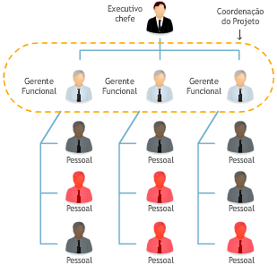
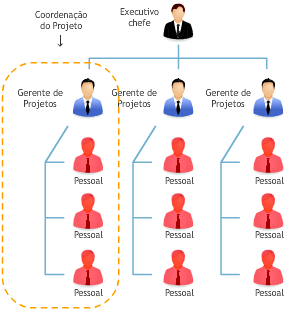
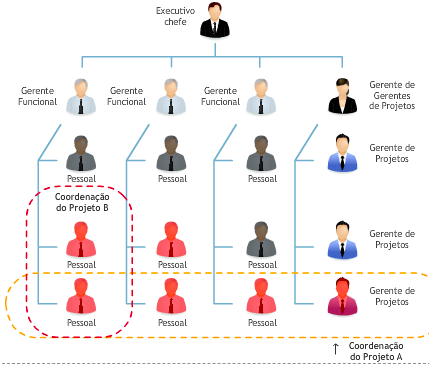
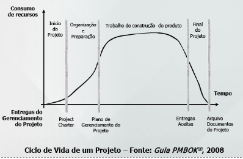

# Aula 1 - Fundamentos de Gerenciamento de Projetos
 

Cada vez mais é exigido que os projetos sejam realizados dentro do **escopo, prazo, custos e qualidade planejados** para o atendimento às necessidades das partes interessadas.

O **gerenciamento de projetos** é a aplicação de conhecimento, habilidades, ferramentas e técnicas as atividades do projeto com o objetivo de atender as necessidades e expectativas das partes envolvidas.
 

Benefícios do gerenciamento de projetos: Gerenciar projetos possibilita uma maior previsibilidade e probabilidade de atingir os objetivos do projeto.
- Maior comprometimento com objetivos e resultado; 
- Disponibilidade de informação para tomada de decisão; 
- Melhorias na qualidade do resultado do projeto; 
- Minimização dos riscos em projetos; 
- Maior integração entre as áreas; 
- Aumento da satisfação do cliente; 
- Redução dos prazos de entrega; 
- Aumento de produtividade; 
- Redução dos custos do projeto.

## Conceitos de projeto e operação 
 

**Projeto é “esforço temporário empreendido para criar um produto, serviço ou resultado exclusivo”.** 

Principais características do projeto: 

- Início e término definidos antes do início do trabalho; 
- Único - Produz um propósito único; 
- Elaborado progressivamente – Desenvolvido em etapas; 

Resultado incerto. 

Um projeto termina quando:

- Os objetivos são alcançados; 
- Fica claro que os objetivos não podem ou não serão alcançados; 
- A necessidade que originou o projeto não existe mais.

**Operação é esforço contínuo que sempre gera o mesmo resultado e não possui hora nem data para acabar.**

Principais características da operação:
- É um trabalho contínuo e, normalmente, repetitivo;
- Seu objetivo é manter o negócio da organização;
- Produz o mesmo produto, serviço ou resultado;
- Resultado determinístico. 
 

**O projeto e a operação têm algumas características em comum**: 
- São realizados por pessoas; 
- Possuem recursos limitados; 
- São planejados, controlados e executados. 

## Project Management Institute - PMI 

O PMI foi criado com o objetivo de organizar, difundir e incentivar as melhores práticas em gerenciamento de projetos no mundo. 

Também o PMI certifica profissionais em gerenciamento de projetos. Esta certificação, muito valorizada no mercado, é denominada PMP (Project Management Professional) 

## Origens dos projetos 

Os projetos são autorizados para atender uma ou mais considerações estratégicas, tais como: 
- Demanda de mercado;
- Oportunidade de negócio;
- Necessidade de natureza social;
- Considerações ambientais;
- Solicitação de cliente;
- Avanço tecnológico;
- Requisito legal. 
 

Problemas mais frequentes em projetos: 
- Não cumprimento dos prazos;
- Mudanças de escopo constantes;
- Problemas de comunicação;
- Escopo não definido adequadamente;
- Riscos não avaliados adequadamente;
- Recursos humanos insuficientes;
- Concorrência entre as atividades rotineiras e o projeto na utilização dos recursos;
- Não cumprimento do orçamento;
- Mudanças de prioridades constantes ou falta de prioridades;
- Estimativas incorretas ou sem fundamento.

## Métodos de análise da viabilidade econômica dos projetos: 

### Payback (tempo de retorno)  

Mede o prazo necessário para a organização recuperar o investimento inicial do projeto. 
Quanto menor for este prazo, melhor para a organização;

### Valor presente líquido (VPL) 

Transporta todas as receitas e custos estimados do projeto, descontados pela taxa mínima de atratividade, para a data de início do projeto.  

O projeto de maior VPL deve ser o selecionado; 

### Taxa interna de retorno (TIR) 

Calcula a taxa de juros que torna anula a soma de todas as receitas e custos estimados do projeto na data de início do projeto. 

O projeto com a maior TIR deve ser o selecionado;
 

### Índice de benefício-custo

Compara os benefícios do projeto com os custos do projeto. 

O índice de benefício-custo igual a 1 significa que os benefícios e custos do projeto se igualam. 

## Escritório de projetos - PMO (project management office) 

É uma unidade organizacional que supervisiona o gerenciamento de projetos. O escritório de projeto pode ser central ou descentralizado em áreas e locais, dependendo do tamanho da organização. 

Um **programa** é um grupo de projetos relacionados entre si, coordenados de forma a obter benefícios que não estariam disponíveis se fossem administrados isoladamente. 

Um **portfólio** é um conjunto de projetos e programas que tem por finalidade atingir objetivos estratégicos da organização. 

## Stakeholders (partes interessadas)

As partes interessadas, também chamadas de stakeholders, são pessoas e organizações envolvidas no projeto ou aqueles cujos interesses são afetados pela execução ou resultado do projeto. A identificação das partes interessadas deve ser realizada o mais cedo possível. 
 

São exemplos de partes interessadas: 
- Gerente do projeto;
- Patrocinador;
- Cliente;
- Parceiros;
- Gerentes funcionais;
- Equipe do projeto;
- Escritório de projetos. 
 

## Tipos de estruturas das organizacionais e suas influências no projeto 

### Organização funcional 

Profissionais agrupados, por especialidade, em departamentos funcionais (Marketing, Contabilidade, Financeiro, Engenharia...). Gerentes de projeto, em geral, são os próprios gerentes funcionais. Os funcionários de vermelho representam os que estão alocados em atividades de projetos.

### Projetizada 

Profissionais agrupados por projetos. Os gerentes de projeto têm total autoridade sobre o projeto. Os profissionais são dedicados exclusivamente ao projeto (sem lar). Os funcionários de vermelho representam os que estão alocados em atividades de projetos.

### Organização matricial 

Profissionais se reportam ao gerente funcional e ao gerente de projetos (pelo menos dois chefes). Gerentes de projetos são os responsáveis pela gestão do projeto. Já os gerentes funcionais são “donos dos recursos” e responsáveis pela alocação de profissionais no projeto. Os funcionários de vermelho representam os que estão alocados em atividades de projetos.

## Ciclo de vida do projeto 

Uma **fase de um projeto** possui um grupo de atividades relacionadas de forma lógica, e sua conclusão é marcada pela **disponibilização de uma ou mais entregas**. 
 

Uma **entrega** é qualquer produto ou serviço, **tangível e verificável**. 

Embora os projetos variem em tamanho e complexidade, sua estrutura pode ser mapeada no ciclo de vida a seguir: 
- Início do projeto; 
- Organização e preparação; 
- Execução do trabalho do projeto; 
- Encerramento. 

## Ciclo de vida do produto  

O ciclo de vida do produto é determinado pelas seguintes fases, basicamente associadas ao nível de quantidades produzidas: 
- Concepção;
- Crescimento;
- Maturidade;
- Declínio;
- Retirada da produção. 
 

## Áreas de conhecimento de Gerenciamento de Projeto  

### Gerenciamento de integração do projeto 

Garantir que os diversos elementos do projeto serão coordenados de maneira integrada; 
 

### Gerenciamento de escopo do projeto  

Garantir que o projeto incluirá todo e somente o trabalho necessário para o sucesso do projeto;  

### Gerenciamento do tempo do projeto 

Garantir que o projeto será concluído no prazo previsto; 
 
### Gerenciamento de custos do projeto  

Garantir que o projeto será concluído dentro do custo previsto; 

### Gerenciamento da qualidade do projeto 

Garantir que o projeto atenderá aos requisitos de qualidade esperados; 

### Gerenciamento dos recursos humanos do projeto 

Garantir a utilização efetiva dos recursos humanos do projeto; 

### Gerenciamento das comunicações do projeto 

Garantir a geração, coleta, disseminação, armazenamento e disponibilização das informações apropriadas do projeto no tempo e de maneira adequada; 

### Gerenciamento das partes interessadas

Garantir o engajamento das partes interessadas com os objetivos do projeto; 

### Gerenciamento dos riscos do projeto 

Garantir a identificação, análise, planejamento, monitoramento e controle dos riscos do projeto;  

### Gerenciamento de aquisições do projeto 

Garantir as aquisições de bens e serviços externos à organização do projeto. 

# Grupos de processos em gerenciamento de processos 

Um grupo de processos deve ser entendido como o trabalho de gerenciamento que deve ser feita em cada fase do ciclo de vida do projeto.  

### Iniciação 

Estabelece as ações para dar início ao projeto ou fase do projeto;  

### Planejamento 

Planeja e mantém um plano de trabalho viável para atingir os objetivos definidos para o projeto; 

### Execução 

Coordena as ações definidas para realizar o plano de trabalho e produzir os produtos a serem entregues em cada fase; 

### Encerramento 

Formaliza o encerramento do projeto ou fase do projeto.

[Baixar PDF de Gerenciamento de Projetos](../../media/gestao_de_projetos/aula01/pdf/gerenciamento_de_projetos.pdf)

## Tríplice restrição 

A tríplice restrição do projeto é formada pelo balanceamento dos objetivos de **escopo, tempo e custos**. Um projeto é considerado bem sucedido quando for concluído dentro das restrições de escopo, tempo e custos.

