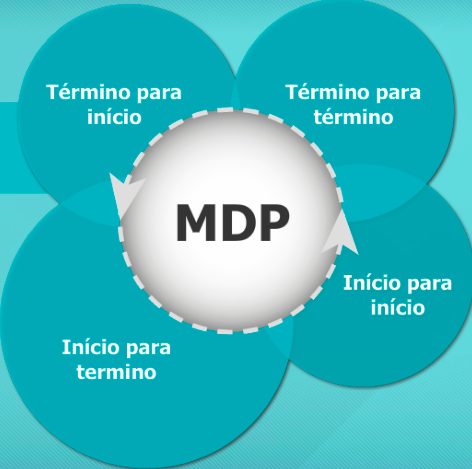
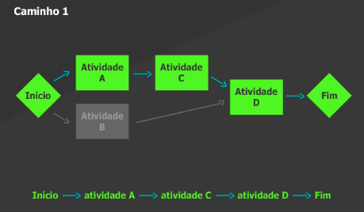
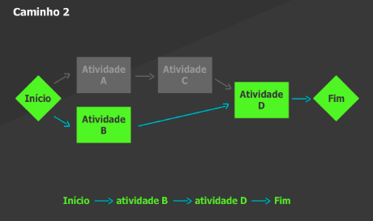
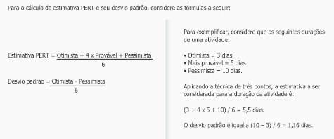
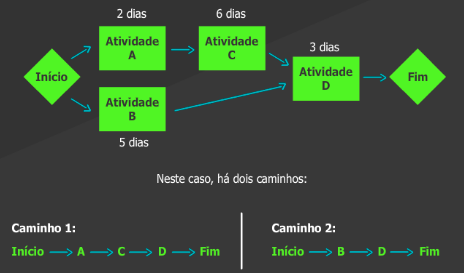
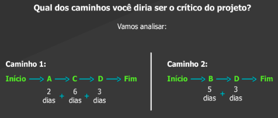
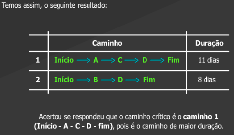

# Aula 4 - Gerenciamento do tempo do projeto 
 
O objetivo destes processos é obter o **cronograma do projeto**. 
- Começando com a identificação das atividades necessárias para a execução dos pacotes de trabalho da EAP e o estabelecimento do sequenciamento destas atividades. 
- Em seguida, são estimados os tipos e quantidades de recursos para a execução das atividades e, consequentemente, as durações que estes recursos necessitam para executar as atividades. 
- Conhecidos as durações e o sequenciamento é o obtido o cronograma do projeto. 
- O cronograma do projeto deve ser analisado, quanto ao atendimento aos prazos, pois é uma das principais preocupações do gerente do projeto verificar se a data de término planejada para o projeto pode ser atendida. 
- Após esta análise, é definida uma versão do cronograma que será adotada como linha de base do cronograma do projeto. 

## Planejamento do tempo do projeto 
 
Para desenvolver o cronograma do projeto, é necessário responder as perguntas: 
- Quais são as atividades necessárias para produzir as entregas do pacote de trabalho da EAP do projeto? 
- Quais são as dependências entre estas atividades? 
- Quantos e quais tipos de recursos são necessários para realizá-las? 
- Qual a estimativa de duração de cada atividade? 

## Método do diagrama de precedência (MDP) 

Para representar as dependências entre as atividades o mais indicado é o método do diagrama de precedência (MDP). 

Ele permite os quatro tipos de relações de dependência: 

 
**Término para início**: A atividade sucessora só pode iniciar após o término da atividade predecessora. É o tipo mais comum de dependência.  

**Início para termino**: O término da atividade sucessora depende da iniciação da atividade predecessora. Esse tipo de dependência raramente acontece. 

**Início para início**: A atividade sucessora só pode iniciar após o início da atividade predecessora. 

**Término para término**: A atividade sucessora só pode terminar após o término da atividade predecessora. 

A sequência das atividades é denominada **diagrama de rede do cronograma do projeto**. Um conjunto de atividades dependentes entre si é denominado **caminho do diagrama de rede**. O diagrama de rede pode ter mais de um caminho. Em comum, todos os caminhos do diagrama de rede têm o início e o fim do projeto. 

 

## Estimativas de recursos necessários para a execução das atividades 

Para estimar os recursos de cada atividade é necessário identificar os tipos e quantidades de recursos que serão utilizados na sua execução: pessoas, equipamentos, materiais, software ou hardware. 

A análise dos recursos considera: 
- Os custos dos recursos; 
- A disponibilidade dos recursos; 
- Recursos próprios do projeto ou terceirizados. 
 
O custo estimado da atividade do projeto está relacionado com os custos dos recursos estimados para sua execução. 

As técnicas utilizadas para realizar a estimativa dos recursos são: 

- Opinião especializada baseada em informações de projetos anteriores; 
- Análise de alternativas de execução, como por exemplo, a análise de “fazer com recursos do projeto” ou “comprar de terceiros”; 
- Dados publicados para auxílio a estimativas, como por exemplo, taxas de produção, preços preestabelecidos com fornecedores, entre outros. 
 

## Estimativas de duração das atividades 

Estimar as durações das atividades consiste em mensurar o período de trabalho que será necessário para concluir as atividades. Existe o princípio empírico de 8/80, que recomenda que uma atividade seja planejada para ser executada no prazo mínimo de 8 horas (um dia) e máximo de 80 horas (quinze dias). 

Algumas técnicas utilizadas: 
- Opinião especializada: baseada na experiência de atividades similares ocorridas em outros projetos; 
- Estimativas por analogia: baseada em informações históricas de atividades similares ocorridas ajustadas as condições do projeto; 
- Estimativas paramétricas: é um modelo matemático que multiplica a quantidade de trabalho a ser realizado pelo valor da produtividade; 
- Estimativas de três pontos (PERT): baseia-se na definição de três estimativas: otimista, mais provável e pessimista; 
- 
 

## Cronograma de projeto 
 
O cronograma é montado a partir dos resultados dos processos anteriores:  
- lista de atividades; 
- diagrama de rede; 
- estimativas de recursos; 
- estimativas de duração das atividades.  

Para finalizar o cronograma, falta determinar as datas de início e fim das atividades e datas de início e fim do projeto. 

### Método do caminho crítico 

Este método é uma técnica de análise do diagrama de rede do cronograma que calcula as datas de início e término mais cedo e de início e término mais tarde de cada atividade do cronograma, considerando sua duração e precedência. 

A partir deste cálculo, é possível avaliar o tempo de folga do cronograma. 

O caminho crítico do projeto é o caminho de **maior duração**, em que todas as atividades possuem a menor folga ou mesmo folga zero.  

É o prazo de duração mínima do projeto. 
 
É fundamental conhecer o caminho crítico do projeto para a avaliação dos riscos e controle do desempenho do projeto, pois qualquer atraso nas atividades do caminho crítico deve ser criteriosamente avaliado.  

## Técnicas de compressão do cronograma 

Após a determinação do caminho crítico, é possível que a data de término prevista do projeto não atenda à necessidade do prazo do cliente para a conclusão do projeto. 

Neste caso, pode-se utilizar a técnica de compressão do cronograma, que possibilita reduzir o prazo do projeto sem alterar o seu escopo. Porém, podem afetar os custos e riscos do projeto. São elas: 

**Compressão (crashing)**: Consiste em adicionar recursos às tarefas do caminho crítico. A desvantagem desta técnica é o aumento de custo. Neste caso, deve-se levar a efeito a análise custo/ benefício de atender o prazo e aumentar o custo; 

**Paralelismo (fast traking)**: Consiste em iniciar ao mesmo tempo duas atividades que, em princípio, seriam realizadas em sequência.  

Ao optar por esta técnica, há um aumento dos riscos do projeto e eventualmente retrabalho. 

O próximo passo é verificar a alocação dos recursos, pois é provável que algum recurso tenha ficado sobrecarregado ou subalocado em termos de carga horária. 

## Nivelamento dos recursos 

A técnica de nivelamento de recursos é utilizada quando: 
- Há restrição de datas específicas; 
- Os recursos são compartilhados em quantidade ou prazo; 
- Se deseja manter um nível constante de utilização dos recursos em determinado período. 

O nivelamento de recursos pode ocasionar mudança no caminho crítico original do projeto. 

## Apresentação do cronograma 

Tabela: Apresenta as atividades, duração, data de início e data de fim do cronograma. 

Gráfico de Gantt (barras): Apresenta o cronograma a partir de barras, demonstrando a duração e as datas de início e término de cada atividade e sua sequência. 

Gráfico de marcos: Apresenta o término das principais entregas, fase ou algum evento importante do projeto. 

## Linha de base e controle do cronograma do projeto 

Após a aprovação, uma versão específica do cronograma servirá como linha de base para o acompanhamento do desempenho dos prazos do projeto. 

O controle do cronograma envolve avaliar, entre outros: 
- Quais atividades já foram concluídas? 
- Existem atividades do cronograma que estão atrasadas ou adiantadas? 
- Quanto tempo ainda falta para terminar uma determinada atividade? 
- A data de conclusão do projeto será ultrapassada? 
- Há necessidade de avaliar a alteração do prazo final do projeto? 

Algumas informações coletadas para avaliar a situação do cronograma são: 
- Datas de início e término reais das atividades concluídas; 
- Duração restante das atividades não finalizadas; 
- Percentual de execução das atividades em andamento. 