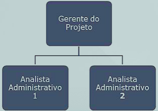

# Aula 7 – Gerenciamento dos recursos humanos do projeto 

## Planejamento dos recursos humanos 

O planejamento de recursos humanos consiste em: 
- Identificar e documentar funções, responsabilidades e relações hierárquicas do projeto; 
- Elaborar o plano de gerenciamento de pessoal. 
 
Fatores a considerar para o planejamento da equipe do projeto: 
- Escassez ou limitação dos recursos e a necessidade de trabalhar com alternativas ou desenvolver opções; 
- A rede de relacionamento do gerente de projetos na eficácia na seleção dos recursos; 
- A recorrente reclamação dos envolvidos sobre a falta de informações sobre suas responsabilidades; 
- A necessidade de designação de pessoas internas ou externas a organização do projeto. 

Outros fatores devem ser considerados para o planejamento da equipe do projeto, como: 
- Tipo de organização; 
- Fatores técnicos; 
- Habilidades interpessoais; 
- Localização da equipe; 
- Influência das partes interessadas. 

 
## Plano de recursos humanos 

Os requisitos dos recursos para a execução das atividades definidos no processo de planejamento do tempo são utilizados para o planejamento da equipe do projeto. O plano de recursos humanos contempla: 

1. Papéis e responsabilidades - para identificar papéis e responsabilidades dos membros da equipe. 
  - 

2. Organograma do projeto – para estabelecer as relações hierárquicas do projeto. 
  - 

3. Plano de gerenciamento de pessoal - contém o plano de mobilização e liberação de pessoal, calendário de recursos, necessidades de treinamento, reconhecimento e recompensas, normas de segurança do trabalho. 

## Mobilização da equipe do projeto 

Consiste em negociar com eficácia os recursos humanos necessários ao projeto e revisar o planejamento do projeto com os novos membros. 
- Pré alocados e já definidos no termo de abertura do projeto; 
- Negociados com gerentes funcionais ou com outras equipes de gerenciamento de projetos dentro de uma organização; 
- Contratados, quando a empresa não possui pessoal interno necessário para executar o projeto; 
- Virtuais, no caso de profissionais trabalharem em diferentes localidades, turnos ou horários. 

 
## Desenvolvimento da equipe do projeto 

Visa aprimorar as competências e as interações entre os profissionais da equipe para aumentar o desempenho da equipe. 

Algumas técnicas utilizadas para auxiliar neste desenvolvimento são: 
- Aprimoramento das habilidades profissionais; 
- Treinamento formal ou informal; 
- Aprimoramento das habilidades interpessoais através de atividades de formação de equipe; 
- Reconhecimento e premiações; 
- Regras básicas de convívio; 
- Agrupamento (matriz integrada). 

A construção de uma equipe se dá em cinco etapas: 
1. Formação – quando a equipe se encontra e conhece o projeto; 
2. Conflito - quando a equipe começa a considerar o trabalho do projeto; 
3. Acordo - quando começa o trabalho em conjunto e ganho de confiança; 
4. Desempenho - quando a equipe ganha unidade; 
5. Dispersão - trabalho concluído, e a equipe se desliga do projeto. 
 
Á medida que os esforços de desenvolvimento da equipe são implementados, as avaliações de desempenho da eficácia da equipe do projeto, orientadas às tarefas e resultados, podem indicar a necessidade de treinamento, orientação, assistência, mentoria ou mudanças. 
 

## Gerenciamento da equipe do projeto 

O gerenciamento da equipe consiste em: 
- Acompanhar o desempenho da equipe; 
- Fornecer feedback; 
- Resolver problemas; 
- Gerenciar conflitos; 
- Gerenciar mudanças para otimizar o desempenho do projeto; 

Envolve: 

- Realização da avaliação de desempenho (esclarecimento de papéis e responsabilidades, questões desconhecidas e criação de plano de desenvolvimento); 
- Observação; 
- Registro de questões; 
- Utilização de técnicas de gerenciamento de conflitos (negociação, imposição, colaboração ou acomodação); 
- Desenvolvimento de habilidades interpessoais. 
 
Esse gerenciamento é mais complexo, quando a equipe presta contas para o gerente funcional e para o gerente de projetos. 
 

## Características do conflito 

Os conflitos são inevitáveis em um projeto. Originam-se por disputas por cronograma, prioridades, recursos, estilos de trabalho pessoais e personalidades. Quando bem gerenciados, agregam valor (produtividade e relacionamento). 

É natural e força uma busca de alternativa; 

É uma questão da equipe; 

A comunicação aberta ajuda na resolução; 

A resolução deve se concentrar em questões e não nas pessoas; 

A resolução deve se concentrar no presente e não no passado. 

 

## Técnicas de gerenciamento de conflito 

 

**Colaboração**: trata-se da construção de uma alternativa que incorpore as diversas soluções. 

 

**Reconciliação**: permite que a solução encontrada traga algum grau de satisfação entre as partes. 

 

**Retirada**: é uma forma de fugir momentaneamente do problema. 

 

**Força**: uma parte de maior autoridade impõe a outra seu ponto de vista. 

 

**Acomodação**: é um acordo onde as partes cedem um pouco para alcançarem uma solução. 

 

## Os tipos de poder do gerente de projeto 

 

**Formal**: é delegado pela organização em função do cargo que exerce. 

 

**Recompensatório**: tem poder para recompensar, inclusive financeiramente, a equipe. 

 

**Penalizatório**: refere-se ao poder de demitir ou afastar um determinado membro da equipe. 

 

**Referencial**: quando se trata de um profissional que é um exemplo a ser seguido por uma ou mais de suas características. 