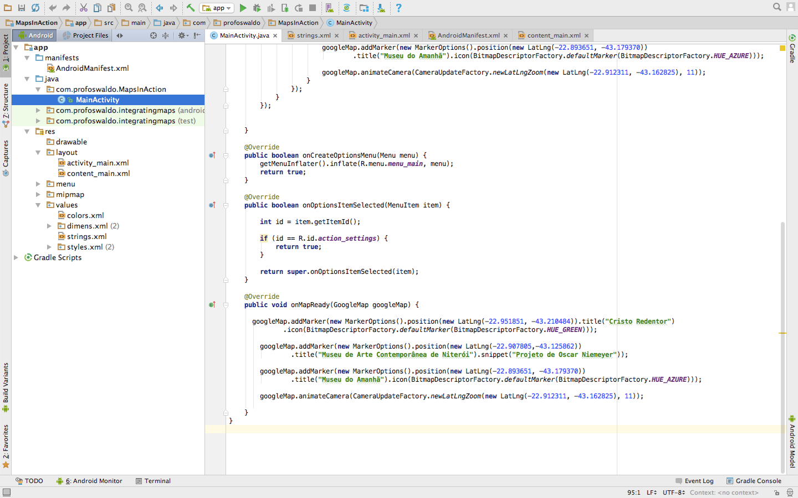
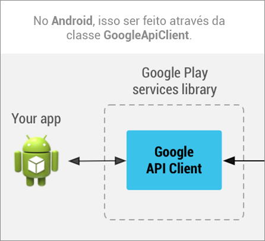

# Aula 10 - Integrando Serviços Google a uma aplicação Android

## Mapas em Android

Entre os vários recursos oferecidos pelo Android, podemos destacar a integração ao Google Maps. A plataforma Android possui um conjunto robusto de classes e interfaces que facilitam o desenvolvimento de aplicativos que permitem a interação com mapas e geolocalização.

Basicamente, existem duas versões da API de mapas da Google.

Maps Android API V1


A versão 1, identificada como Google Maps Android API V1, foi descontinuada em dezembro de 2012. Ela era implementada pela classe MapView.

A principal limitação dessa versão consistia em que só era possível exibir um mapa de cada vez por tela, o que era uma grande desvantagem para o tablets.


Na mesma data, a Google lançou a Google Maps Android API V2. Além de um ganho significativo no desempenho, esta foi criada para suportar visualizações 2D e 3D. Inclusive, quando a visualização estiver bastante perto, poderá ocorrer automaticamente a comutação da visualização de 2D para 3D, caso a cidade possua visualização 3D.

A principal diferença para a API V1 é que passamos a utilizar fragments, conceito este que estudamos em nossa aula 5.

De uma forma resumida, podemos dizer que substituímos o uso de MapView por MapFragments.

### Gerando chave de acesso

Para que nossos mapas funcionem, precisamos criar uma chave de autenticação no serviço Google. Isso só é possível se possuirmos uma conta da Google.

Clique aqui para acessar a criação desta chave.

### Configurando permissões do sistema

Outro ponto necessário para que nossos aplicativos rodem com Google Maps é a configuração de algumas permissões no arquivo AndroidManifest.xml, visto que, por padrão, os aplicativos básicos não possuem permissões associadas.

A seguir, são apresentadas algumas das principais permissões usadas por aplicativos Android.

```java

<uses-permission android:name=“android.permission.INTERNET” />
• Permite o acesso à Internet.

<uses-permission android:name=“android.permission.ACESS_NETWORK_STATE” />
• Permite a leitura do estado da rede.

<uses-permission android:name=“android.permission.WRITE_EXTERNAL_STORAGE” />
• Permite gravar informações no SD card.

<uses-permission android:name=“android.permission.READ_EXTERNAL_STORAGE” />
• Permite ler informações no SD card.

<uses-permission android:name=“com.google.android.providers.gsf.permission.READ_GSERVICES” />
• Permite acessar os serviços da Google.

<uses-permission android:name=“android.permission.ACCESS_COARSE_LOCATION” />
• Permite acessar o GPS por triangulação de antenas.

<uses-permission android:name=“android.permission.ACCESS_FINE_LOCATION” />
• Permite acessar o GPS por hardware.

```

### Configurando chave de acesso

Além das permissões do sistema, precisamos configurar a chave de acesso em nosso arquivo AndroidManifest.xml.

O exemplo abaixo traz um pequeno trecho de código demonstrando essa configuração:


Atenção! Não se esqueça de que a chave acima, indicada pela seta vermelha, corresponde a que criamos. Substitua pela sua.

### Declarando dependência no arquivo app/buid.gradle

Para usar o Google Play Services, também precisamos declarar a dependência na build.gradle (Módulo: app) de arquivos e sincronizar os arquivos Gradle.

1. Primeiro, vamos incluir a linha Compile 'com.google.android.gms: play-services: 8.3.0' em dependências
   - Depois, vamos sincronizar o arquivo.

Para facilitar, veja na imagem abaixo a declaração dessa dependência:


Atenção! Pode ser que haja novas versões da biblioteca quando estiver implementando seu exemplo. Fique à vontade para alterar.

Além disso, também precisamos configurar a versão do Google Play Service em nosso arquivo AndroidManifest.xml.

Isso é feito inserindo a tag abaixo dentro da application e não da activity:


### Exemplo com Mapas

Para usar o Google Play Services, também precisamos declarar a dependência na build.gradle (Módulo: app) de arquivos e sincronizar os arquivos Gradle.

Para facilitar o entendimento, vamos desenvolver um pequeno exemplo implementando Mapa em um aplicativo Android.

Criaremos um projeto Android novo.


#### Editar AndroidManifest.xml

Como nosso aplicativo precisará acessar a Internet, estamos configurando a permissão para tal.

Também estamos configurando a nossa chave de acesso aos serviços da Google.

Não se esqueça de, quando for implementar, substituir pela sua chave.

A tela abaixo ilustra essas configurações:


#### Implementar layouts

Chegou a vez do layout referente ao nosso mapa propriamente dito.

Precisamos adicionar um objeto Fragment à nossa Activity que processará o mapa.

Poderíamos adicionar o fragment via código Java, mas a forma mais fácil de fazer isso é adicionando um elemento <fragment> ao arquivo de layout.

No arquivo content_main.xml, definimos apenas o fragment referente ao nosso mapa.

Isso é demonstrado na imagem abaixo:


Como já discutimos anteriormente o aninhamento de layouts, optamos por desenvolver o layout de nossa tela no arquivo activity_main.xml, onde estamos efetuado o aninhamento do layout, referente ao mapa, na linha <include layout="@layout/content_main" />.

Isso é demonstrado na tela abaixo:


#### Implementar MainActivity.java

Chegou a vez de nossa atividade principal, codificada no arquivo MainActivity.java.

Devido ao tamanho de nosso código, ela foi ilustrada em duas telas:




Além dos vários códigos discutidos em exemplos de outras aulas, encontramos algumas novidades com relação a classes e interfaces sendo implementadas. Clique [aqui](http://estacio.webaula.com.br/cursos/gon283/galeria/aula10/docs/pdf_aula10_slide11.pdf) e conheça.

## Localização em Android

No desenvolvimento de aplicativos Android, o recurso de posicionamento geográfico é muito explorado.


Muitos aplicativos usam as coordenadas de latitude e longitude para informar ao usuário onde ele está localizado, como, por exemplo, os aplicativos de navegação GPS (Global Positioning System).

Antigamente, usávamos a classe LocationManager para obter a localização GPS.

Para acessar o provedor GPS, esta classe possuía várias constantes, das quais podemos destacar:

- LocationManager.GPS_PROVIDER: Usa os satélites GPS para determinar uma posição. É mais preciso, porém um pouco mais lento.
- LocationManager.NETWORK_PROVIDER: Usa a triangulação de antenas de operadora e sinal Wi-Fi para determinar uma posição. É muito mais rápido, porém muito mais preciso.

## Consumo de bateria

Um grande desafio que precisava ser vencido era o consumo de bateria. Isso ocorria pois a maioria dos aplicativos não fazia as otimizações necessárias, no que tange ao uso do GPS, utilizando, assim, recursos demais e implicando alto consumo de bateria.

Hoje a Google criou o Fused Location Provider. Este encapsula os provedores GPS_PROVIDER e NETWORK_PROVIDER de forma transparente, tornando muito mais simples o desenvolvimento. Sem falar no ganho expressivo que temos na otimização de recursos e, consequentemente, de bateria.

## Como fazer uso de uma API do Google Play Services?

Para que possamos fazer uso de qualquer API do Google Play Services, precisamos primeiramente nos conectar ao Google.



Também precisamos implementar um objeto do tipo LocationRequest. Através dele configuraremos não só a precisão mas o intervalo de tempo com o qual se deseja obter as coordenadas.

Vamos a um exemplo para que possamos entender na prática.

Observe que nossa activity implementa a interface com.google.android.gms.location.LocationListener. Com isso, somos obrigados a implementar o método void onLocationChanged(Location location), que recebe por parâmetro um objeto do tipo Location toda vez que o Android tiver uma nova localização.

Nesse mesmo método, estaremos exibindo em nossa tela as coordenadas de latitude e longitude através de dois TextViews.

Isso pode ser observado no trecho de nosso código abaixo:

```java

@Override
    public void onLocationChanged(Location location) {
        setLatitude(location.getLatitude());
        setLongitude(location.getLongitude());
        Toast.makeText(getApplicationContext(), "Nova localização recebida",
Toast.LENGTH_LONG).show();
        textViewLatitude.setText(getString(R.string.latitude_string) +" "+ getLatitude());
        textViewLongitude.setText(getString(R.string.longitude_string) +" "+ getLongitude());
    }


```

Antes de fazer a conexão, devemos verificar se o Google Play Services está instalado no dispositivo. Para esse propósito, foi criado o método checkPlayServices(), chamado em nosso exemplo de onCreate().

Observe que estamos fazendo uso do método isGooglePlayServicesAvailable() da classe GooglePlayServicesUtil, que verifica se o Google Play Services está instalado e ativo no dispositivo.

Seu retorno corresponde ao código de status, indicando se houve algum erro ou não.

Para não termos que decorar os valores dos erros, estamos lançando mão da classe ConnectionResult, que possui várias constantes referentes a esse status.

Entre estas, podemos destacar:

- SUCCESS: Conexão realizada com sucesso.

- SERVICE_MISSING: Google Play Services não disponível neste dispositivo.

- SERVICE_VERSION_UPDATE_REQUIRED: Versão do Google Play Services instalada está desatualizada.

- SERVICE_DISABLED: Versão do Google Play Services instalada está desativada.

- SERVICE_INVALID: Versão do Google Play Services instalada é inválida.

Caso não haja sucesso na conexão, podemos verificar se o erro pode ser resolvido por uma ação do usuário, através do método isUserRecoverableError() da classe GooglePlayServicesUtil.

Para facilitar a visualização, abaixo temos o trecho de código responsável por esta verificação:

```java

private boolean checkPlayServices() {
        int resultCode = GooglePlayServicesUtil.isGooglePlayServicesAvailable(this);
        if (resultCode != ConnectionResult.SUCCESS) {
            if (GooglePlayServicesUtil.isUserRecoverableError(resultCode)) {
                        Toast.makeText(getApplicationContext(),
                        "Erro. Efetue o download google play services", Toast.LENGTH_LONG)
                        .show();
            } else {
                Toast.makeText(getApplicationContext(),"Erro.", Toast.LENGTH_LONG).show();
                finish();
            }


```

Dando continuidade à análise do código, podemos observar, no método onCreate(), que, após verificar se o serviço está disponível, estamos executando o método startFusedLocation(), desenvolvido para efetuar a conexão ao Google Play Services.

Neste, criamos o objeto do tipo GoogleApiClient, caso não exista.

Para criarmos, precisamos instanciar esse objeto com a linha new GoogleApiClient(x), onde x corresponde ao contexto a ser usado pela conexão.

A partir daí, essa classe nos oferece uma série de métodos, dos quais, para estabelecer a conexão, destacam-se:


Para realizar a conexão, basta chamar o método connect().

Vejamos, então, nosso código do método startFusedLocation():

```java

public void startFusedLocation() {
        if (googleApiClient == null) {
            googleApiClient = new GoogleApiClient.Builder(this).addApi(LocationServices.API)
                  .addConnectionCallbacks(new GoogleApiClient.ConnectionCallbacks() {
                        @Override
                        public void onConnectionSuspended(int cause) {  }

                        @Override
                        public void onConnected(Bundle connectionHint) {   }
                    })
                  .addOnConnectionFailedListener(new GoogleApiClient.OnConnectionFailedListener(){
                        @Override
                        public void onConnectionFailed(ConnectionResult result) { }
                    })
                  .build();
            googleApiClient.connect();
        } else {
            googleApiClient.connect();
        }
    }


```

Configuramos a API de localização, no método addApi(), através da constante LocationServices.API.

É importante saber que existem muitas outras API que podem ser configuradas através desse método como, por exemplo, Drive.API, referente ao Google Drive.

Estamos registrando no método addConnectionCallbacks o ouvinte referente à nossa conexão.

A interface GoogleApiClient.ConnectionCallbacks exige que sejam implementados dois métodos:


Já no método addOnConnectionFailedListener(), estamos registrando o ouvinte referente à falha de conexão. A interface GoogleApiClient.OnConnectionFailedListener() nos obriga a implementar o método onConnectionFailed(), que é chamado quando ocorre um erro de conexão.

Para efetuar a conexão propriamente dita, usamos o método connect() do objeto GoogleApiClient. Já para desconectar, apenas precisamos chamar o método disconnect().

Para finalizar, foi desenvolvido o método registerRequestUpdate(), chamado no onCreate(), após o método startFusedLocation().

Veja o seu código abaixo:

```java

public void registerRequestUpdate(final LocationListener listener) {
        locationRequest = LocationRequest.create();
        locationRequest.setPriority(LocationRequest.PRIORITY_HIGH_ACCURACY);
        locationRequest.setInterval(1000);
        new Handler().postDelayed(new Runnable() {
            @Override
            public void run() {
try {
                    LocationServices.FusedLocationApi.requestLocationUpdates(googleApiClient,
                                locationRequest, listener);
                } catch (SecurityException e) {
                    e.printStackTrace();
                } catch (Exception e) {
                    e.printStackTrace();
                    if (!isGoogleApiClientConnected()) {
                        googleApiClient.connect();
                    }
                   registerRequestUpdate(listener);
                }
            }
        }, 1000);
    }


```

### Classe LocationRequest


Embora grande parte do código já seja de seu conhecimento, temos algumas novidades. Entre elas a classe LocationRequest.

Através dela, podemos efetuar configurações referentes à atualização da localização, como a precisão e o intervalo de tempo com as quais desejamos receber as coordenadas.

Para criar um objeto desse tipo, basta instanciar a classe.

Essa classe também possui vários métodos e constantes, dentre as quais destacam-se:

Métodos:

setPriority: Define a precisão do GPS. As constantes mais utilizadas são PRIORITY_HIGH_ACCURACY e PRIORITY_LOW_POWER.
setInterval: Intervalo de tempo, em milissegundos, das atualizações do GPS.
setFastestInterval: Intervalo mínimo de tempo, em milissegundos, das atualizações do GPS.

Constantes:

PRIORITY_HIGH_ACCURACY: Retorna a localização mais precisa possível.
PRIORITY_LOW_POWER: Retorna a localização aproximada visando economizar bateria.
PRIORITY_NO_POWER: Não inicia o monitoramento do GPS, mas garante que, se outra aplicação o fizer, receberemos essa localização. Com isso, não há um consumo adicional de energia.

### Método requestLocationUpdates()

Por último, temos o método requestLocationUpdates(), que efetivamente recupera a última localização conhecida pelo sistema.

Vamos executar nosso aplicativo e constatar uma tela similar à ilustrada abaixo:


