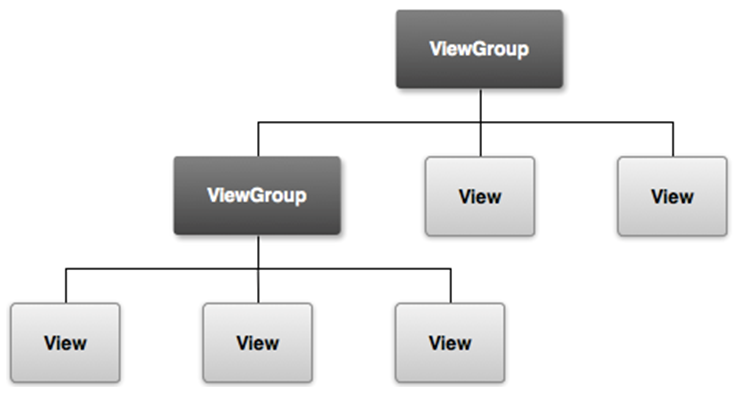

# Aula 3 - Interface Gráfica do Usuário

## Componentes gráficos

A interface com o usuário é um ponto fundamental para o desenvolvimento de aplicativos Android, pois é através desta que o usuário interage.

A construção desse canal de comunicação demanda bastante tempo para desenvolvimento, principalmente no cenário mobile. Nele existe uma variedade muito grande de tipos dispositivos móveis, que, muitas vezes, possuem uma capacidade de tela superior até mesmo às televisões de última geração.

Para tanto, o Android oferece suporte nativo para o desenvolvimento de interfaces gráficas sofisticadas.

Podemos destacar a View, que é a classe base de todo e qualquer componente gráfico. Responsável por desenhar e controlar os eventos.

## Tipos de componentes

O Android fornece um conjunto muito grande de componentes, mas podemos agrupá-los em dois tipos:

Widgets: representa os componentes gráficos. É a base para a criação de componentes da interface, do usuário interativo, como, por exemplo, botões, caixas de texto entre outros.

View group: é a classe base para os gerenciadores de layout. Diferente do widgets, funciona como um container para outras views.

A imagem abaixo ilustra a hierarquia da classe View, demonstrando que o Android oferece um sofisticado e poderoso modelo baseado em Widgets e Layouts.


## Tipos de componentes gráficos

### TextView

Considerado um dos componentes mais usados em Android. Define um texto que será exibido na tela.

Por default, não pode ser editado, embora possamos alterar essa configuração.

```

< TextView
        android:id="@+id/resultado"
        android:layout_width="match_parent"
        android:layout_height="wrap_content"
        android:textAppearance="?android:attr/textAppearanceLarge"
        android:scrollHorizontally="true"
        android:textSize="40dp"/>

```

### Button

Nada mais é do que um simples botão.

Após clicarmos nele, podemos executar uma ação.

```

< Button
        android:id="@+id/button1"
        android:layout_width="80dp"
        android:layout_height="70dp"
        android:text="7"
        android:textSize="40dp" />

```

### ImageView

Responsável por inserir imagens.

```

< ImageView
        android:id="@+id/imageView1"
        android:layout_width="fill_parent"
        android:layout_height="fill_parent"
        android:src="@drawable/ic_launcher" />

```

### EditText

Uma caixa onde é digitada alguma informação, que poderá ser usada para interagir com a aplicação Android.

```

< EditText
        android:id="@+id/editText1"
        android:layout_width="fill_parent"
        android:layout_height="wrap_content"
        android:ems="10" >

```

### CheckBox

Um botão do tipo “caixa de seleção”, onde existe dois estados: verdadeiro ou falso.

```

< CheckBox
        android:id="@+id/cbbTeste"
        android:layout_width="wrap_content"
        android:layout_height="wrap_content"
        android:text="Exemplo />

```

### RadioButton

Similar ao CheckBox, porém não deve permitir a seleção de mais de uma opção.

### RadioGroup

Tem por objetivo agrupar estes radiobuttons, permitindo a seleção de apenas um RadioButton dentro deste Radiogroup.

```

< RadioGroup
        android:id="@+id/radioSex"
        android:layout_width="wrap_content"
        android:layout_height="wrap_content" >

< RadioButton
        android:id="@+id/radioMale"
        android:layout_width="wrap_content"
        android:layout_height="wrap_content"
        android:text="@string/radio_male"
        android:checked="true" />

< RadioButton
        android:id="@+id/radioFemale"
        android:layout_width="wrap_content"
        android:layout_height="wrap_content"
        android:text="@string/radio_female" />
```

## Implementação de Uis

Podemos implementar as Uis do usuário de forma declarativa e programática. Na declarativa, fazemos uso do XML para declarar a aparência da interface.

Já na programática, implementamos através da linguagem Java.
Podemos fazer uma analogia de declarativa com HTML e programática com a Swing e AWT do Java.

Devemos dar preferência sempre a forma declarativa, pois tende a ser mais fácil de entender, desenvolver e até mesmo manutenir.

## Gerenciadores de Layout

Aprendemos como desenvolver telas gráficas no Android, a partir de elementos visuais conhecidos por Widgets.

Porém, precisamos melhorar a qualidade de nossas telas, tarefa que nem sempre é tão fácil, no que tange à implementação.

Nossas aplicações precisam ser executadas em vários tipos de dispositivos diferentes, mas nem todos possuem as mesmas características, como, por exemplo, tamanho da tela.



Como apresentado anteriormente, a classe View é a base para todo e qualquer componente visual no Android. Já a classe ViewGroup tem como responsabilidade organizar os componentes de uma tela.

São conhecidos como Gerenciadores de Layouts. Funcionam como container para outros tipos de Views, podendo ser Widgets ou até mesmo outros ViewGroups.

## Principais layouts

**AbsoluteLayout (android.widget.AbsoluteLayout)**:

Os componentes são posicionados na tela em função das coordenadas X e Y fornecidas.

**FrameLayout (android.widget.FrameLayout)**:

O componente ocupa a tela inteira. Funciona como uma pilha sendo que uma view fica por cima da outra.

**LinearLayout (android.widget.LinearLayout)**:

Os componentes são organizados na vertical ou horizontal.

**TableLayout (android.widget.TableLayout)**:

Assim como em uma tabela, os componente são organizados em colunas e linhas.

**RelativeLayout (android.widget.RelativeLayout)**:

A organização do componente é implementada relativa a outro componente.

### AbsoluteLayout(deprecated)

Nesse tipo de gerenciador de layout, todos os componentes são posicionados em função de abcissa e ordenada, tendo como base o canto superior esquerdo.

É bastante oportuno lembrar que esse é menos flexível e mais difícil de manter que os demais gerenciadores. É importante também saber que esse gerenciador está obsoleto (Deprecated).

### FrameLayout

Serve para reservar um espaço na tela que será utilizado por um ou mais componentes.

Quando mais de um componente for inserido dentro de um único FrameLayout, haverá uma sobreposição dos mesmos. A menos, é claro, que você divida a tela e coloque cada um na sua posição.

### LinearLayout

Esse tipo de gerenciador de layout tem por característica a capacidade de alinhar verticalmente ou horizontalmente os componentes. Isso depende, obviamente, da orientação escolhida.

### RelativeLayout

O RelativeLayout organiza os componentes do layout de uma tela em relação uns aos outros.

Isso é uma grande vantagem deste gerenciador de layout, no que tange à flexibilidade de posicionamento dos componentes.

### TableLayout

Esse gerenciador de layout organiza seus componentes em colunas e linhas, ou seja, como uma tabela.

Cada < tableRow >< /tableRow > corresponde a uma linha de nossa tabela. As colunas são criadas à medida que incluímos os componentes em cada linha.
