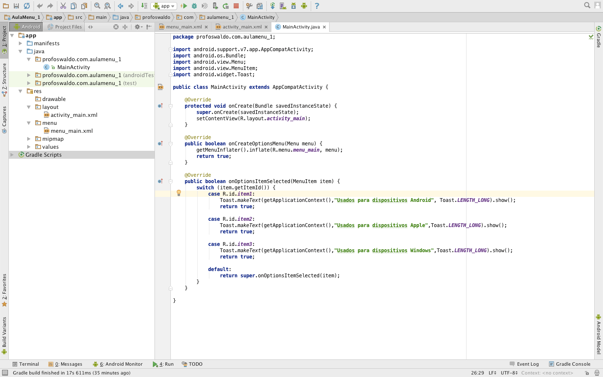
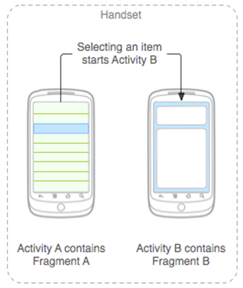

# Aula 5 - Menus e Fragmentos

## Menus

Em aplicativos Android, um recurso extremamente utilizado é o de menu. Basta você baixar alguns aplicativos na Google Play Store que os encontrará facilmente.

Embora sejam de fácil implementação, devemos reforçar os cuidados em relação à usabilidade e aparência dos mesmos. É muito comum encontrarmos aplicativos sem nenhum menu, menus sem ícones ou até mesmo com títulos inapropriados.

Por isso, é importante lembrarmos de que um bom apelo visual e/ou textual facilitará muito a interação do usuário com o aplicativo.

Podemos trabalhar com três tipos de menus em Android:

### Menu de opção e barra de opção

- É o menu default das aplicações Android;
- Normalmente encontramos nesse menu as principais opções.

Existem dois modelos:

1. Ícone (icon menu):

   - Disponível parte inferior da tela;
   - Suporta até seis itens de menu;
   - Suporta ícones;
   - Não suporta caixa de seleção;
   - Não suporta botões de rádio;
   - Android 2.3.x – API Level 10 ou Inferior.

2. Expandido (expanded menu):
   - Suporta mais de seis itens de menu;
   - Apresentado automaticamente na opção Mais (More) quando possuir mais de seis itens de menu;
   - Android 3.0 – API Level 11 ou superior.

### Menu de contexto

- É exibido quando o usuário clica e segura, por mais de 2 segundos, um componente visual;
- Não suporta atalhos, ícones ou até mesmo submenus;
- Pode ser compartilhado entre diferentes Views.

### Menu Pop-up

- Abre quando tocamos no item de menu Options (Opções) ou em menu contextual;
- Não suporta ícones;
- Não suporta submenus aninhados;

## Action Bar


### App Icon

- Exibe o ícone do projeto ou logo customizado;
- Back Navigation Icon - permite a navegação para cima na hierarquia de telas.

### View control

- Exibe o título do aplicativo ou a tela em que o usuário se encontra;
- Exibe o controle de Navegação (Drop-down ou Tabs).

### Action buttons

- Exibem as ações mais comuns em seu aplicativo;
- Os ícones que não couberem nesse espaço serão inseridos automaticamente no Action OverFlow.

### Action Overflow

- Exibe as ações não utilizadas frequentemente de seu aplicativo.

Podemos desenvolver menus Android através de:

- Codificação (Java): desenvolvido no código de sua atividade;
- Arquivo XML: definido em um arquivo XML.

Exemplo:

Crie um novo projeto Android. Em nosso exemplo, o chamaremos de AulaMenu_1.

Provavelmente, não existe a pasta menu em sua árvore de recursos. Por isso, clique com o botão direito na pasta res e crie o diretório menu.

Agora crie o arquivo xml, chamado menu_main.

Nesse arquivo, serão definidos os itens que comporão nosso menu. Veja a tela:


Se você olhar mais atentamente o código, perceberá que cada tag item é referente a uma opção do menu.

No nosso exemplo, os parâmetros são:

- android:id - Esse id é exclusivo para cada item. É através dele que podemos identificar o item de menu;
- android:title - É o texto título de nosso item de menu;
- aandroid:icon - Embora não tenha sido usado nesse exemplo, poderia definir um ícone para o nosso menu. O valor aqui é a referência a um drawable;
- android:showAsAction - Define a forma de exibição do componente.

As constantes que devemos empregar são:

- Always: o componente sempre fica visível. Recomendado para ações mais comuns do aplicativo.

- IfRoom: o componente é exibido na action bar, se existir espaço. Adequado para manter compatibilidade com diversos tipos de dispositivos e também com telas na vertical ou horizontal.

- WithText: o componente exibe o seu título ao lado do ícone, caso tenha espaço disponível.

- Nerver: não exibe o componente na action bar.

- CollapseActionView: quando a view é grande, deve ser contraída para exibidar apenas um botão.

É oportuno saber que também podemos combinar as constantes com separadores, como, por exemplo, ifRoom|withText.

Faça um teste em nossos exemplos. Você vai se surpreender com essas combinações.

Nesta próxima tela, temos algumas novidades.



Quando o botão físico do menu for acionado, o método `onCreateOptionsMenu (Menu menu)` de nossa atividade é invocado e, em nosso exemplo, faz uso do `MenuInflater` para criar o menu definido no arquivo menu_main.xml.

Isso pode ser verificado no método abaixo:

```java

@Override
  public boolean onCreateOptionsMenu(Menu menu) {
      getMenuInflater().inflate(R.menu.menu_main, menu);
      return true;
  }

```

Ao clicar em uma das opções do menu, o `onOptionsItemSelected(MenuItem item)` entra em ação.

Mas não para por aí, a classe `Toast(import android.widget.Toast)` é outra grande novidade. Ela é bastante similar ao nosso velho conhecido `JOptionPane`. Seu objetivo é exibir, por alguns segundos, uma pequena e breve mensagem de alerta para nosso usuário, sobre a tela vigente de nossa aplicação.

Podemos definir sua posição e até mesmo personalizar seu layout, mas esta nunca receberá o foco.

Sua sintaxe é bastante simples de entender. `Toast toast = Toast.makeText(contexto, texto, duracao); toast.show();`

Os parâmetros dessa classe correspondem:

- Ao contexto: este é o contexto de onde será exibida a mensagem.
- Ao texto: a mensagem que deverá exibida para o nosso usuário.
- À duração: é a definição do tempo que a nossa mensagem será exibida na tela.

Podemos configurar a partir das seguintes constantes:

- Toast.LENGTH_LONG - 4 segundos;
- Toast.LENGTH_SHORT - 2 segundos.

Após configurarmos nossa mensagem, é necessário executar o método .show() para que possa ser exibida.

Pronto. Excute sua aplicação para ver a tela abaixo.


Selecione uma das opções de nosso menu.

Observe que a mensagem foi exibida na parte inferior da tela.

Podemos alterar isso. Basta definirmos o método .setGravity().

Sua sintaxe é toast.setGravity(constante, valor_x, valor_y), onde:

- Constante: Constante Gravity. Existem várias constantes que você pode empregar e até mesmo combinar.

- Valor_x: Deslocamento x da posição;

- Valor_y: Deslocamento y da posição.

Exemplo 1: `toast.setGravity(Gravity.TOP|Gravity.LEFT, 0, 0);`

## Fragmento

Bastante similar a uma Activity, um fragmento (fragment) consiste em uma pequena porção de Activty, que permite um projeto mais modular.

Não seria errado afirmarmos, assim, que um fragment é uma espécie de subactivity.

Esse conceito surgiu com o Android 3.0 (Honeycomb) devido à necessidade de customizá-lo para as interfaces dos aplicativos, em função da pluralidade de tipos e tamanhos de dispositivos, em especial os tablets.

Veremos agora que um fragment é muito mais do que dividir a tela em duas ou mais. Vamos analisar o exemplo da tela abaixo para compreender o conceito:



Podemos perceber que na do SmartPhone, ao selecionarmos uma opção da lista, é necessário apresentar outra tela, devido ao tamanho do dispositivo.


Já na figura do tablet a navegabilidade se dá na mesma tela.

É uma boa prática de desenvolvimento em Android sempre encapsular o código de uma activity em um fragment. Isso permite a reutilização deste código em outro contexto.

### Características

- Possui seu próprio layout e comportamento com os seus retornos de chamada do ciclo de vida;
- Pode ser utilizado em várias activities;
- Permite adicionar ou remover fragments de uma activity em execução;
- Ciclo de vida de um fragment está intimamente relacionado ao ciclo de vida de sua activity de acolhimento, o que significa que, quando a activity estiver em pausa, todos os fragments disponíveis na activity também serão interrompidos;
- Permite combinar vários fragments em uma única activity;
- Permite implementar um comportamento que não tem nenhum componente interface do usuário.

### Ciclo de vida de Fragment

Embora o Fragment possua seu próprio ciclo de vida, que é bastante similar ao de uma activity, este não é uma entidade independente.

Na verdade, é parte de uma activity hospedeira, que orienta o seu ciclo de vida.

Isso é demonstrado na figura abaixo:


## Métodos do ciclo de vida


## Fragments e suas subclasses

Para implementar um fragment é preciso estender uma das classes abaixo:

Fragments - Comportamento específico dentro de uma Activity (Ex: parte de interface ou operação);
DialogFragment - Exibir uma janela por cima da janela de sua Activity;
ListFragment - Exibe uma lista de itens de uma fonte de dados;
PreferenceFragment - Armazena e acessa dados de configuração de uma aplicação;
WebViewFragment - Exibe WebView.

## API de Fragments

As principais classes da API Fragments são:

Fragment(android.app.Fragment)

- Classe que o fragment deve estender;
- É necessário sobrescrever o método onCreate (inflater, container, bundle) para criar a view.

Fragment(android.app.Fragment)
Classe que gerencia os fragments pela API;

Possui métodos findFragmentById(id) e findFragmentByTag(tag) utilizados para encontrar os fragments no layout, de forma similar ao método findViewById(id) que uma activity utiliza para buscar uma view.

Fragment(android.app.FragmentTransaction)

Classe utilizada para adicionar, remover ou substituir os fragments dinamicamente no layout.

## Criando Fragmentos

Para implementar um fragment, basta seguir os três passos básicos:

- Criar uma subclasse do fragment
- Definir o layout do fragment
- Incluir o fragment dentro da activity
