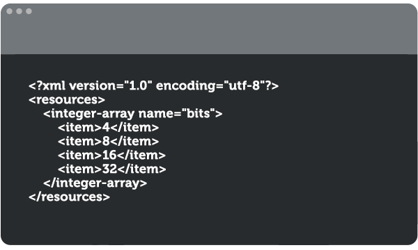
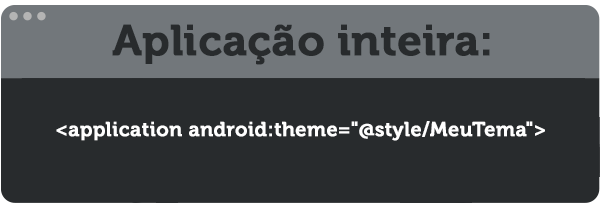
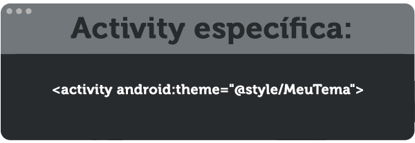

# Aula 7 - Estilos e Temas

## Recursos do Android

O desenvolvimento de interfaces para dispositivos móveis de qualidade é um fator determinante para o sucesso de qualquer aplicativo.

Conceitos como usabilidade, User Interface(UI) e User Experience(UX) nunca estiveram tão em pauta quanto nos dias de hoje. Porém, operacionalizar este desenvolvimento não é algo tão trivial assim.

Para tanto, o Android nos oferece uma série de recursos que facilitam não só o desenvolvimento, como a manutenção dessas interfaces.

Entre eles podemos destacar o tratamento, em arquivo XML, de:

- Dimensões;
- Cores;
- Strings;
- Valores;
- Estilos;
- Temas.

### Dimensões

Em grande parte de nossos exemplos, configuramos as dimensões de nossos componentes usando os parâmetros fill_parent, match_parent e wrap_content.

Também podemos configurar através de um número seguido de uma unidade de medida, como, por exemplo, 10sp.

Abaixo é demonstrada as unidades de medidas suportadas pelo Android:

- dp: É muito usada no desenvolvimento de layouts. Esta unidade abstrata baseia-se na densidade física da tela. A proporção de dp pode mudar com a densidade da tela, mas não a sua proporção. O conceito de dp é bastante complexo. Para maiores informações consulte o link: https://developer.android.com/guide/practices/screens_support.html

- sp: É muito usada para especificar tamanho da fonte em um aplicativo. Esta unidade é bastante similar à unidade de medida dp, mas é dimensionada de acordo com a preferência do tamanho de fonte do usuário.

- px: É uma unidade de medida não recomendada, salvo em casos bem específicos. Aqui um pixel corresponde a um pixel da tela. Ao desenvolvermos para um dispositivo específico, pode funcionar bem, mas em outros, devido à diferença de tamanho e densidade das telas, o resultado normalmente não é o esperado.

- pt: Pelo mesmo motivo da px, não é uma unidade de medida recomendada, pois tem como base o tamanho físico da tela. Um pt corresponde a 1/72 polegadas.

- mm: Assim como px e pt, também não é recomendada, pois trabalha com o tamanho físico da tela em milímetros.

- in: Assim como px, pt e mm, também não é recomendada, pois trabalha com o tamanho físico da tela em polegadas.

O Android permite que tratemos as medidas de qualquer componente via código Java, porém devemos defini-las em um arquivo chamado dimens.xml.

Você poderá encontrá-lo na pasta res/values de nosso projeto Android.

### Cores

Assim como as dimensões, também podemos definir a cor diretamente em nossas propriedades ou, como recomendado, em um arquivo chamado colors.xml. Este também se localiza na pasta res/values.

Em sua documentação oficial, a Google recomenda o uso da paleta de cores que pode ser encontrada no link: //www.google.com/design/spec/style/color.html

O padrão RGB (Red/Green/Blue) é usado para definir cores nas telas Android.

Para implementá-las, usamos a notação hexadecimal que é baseado no sistema de contagem com base 16.

Precisamos de seis caracteres precedidos pelo carater # para representar a cor, onde os dois primeiros são referentes à cor vermelha, os dois seguintes à cor verde e os dois últimos à cor azul.

Veja o exemplo abaixo:

Como já discutimos e exemplificamos em várias aulas anteriores o componente Button, abaixo apenas ilustramos um trecho de código que configura as cores de fundo e do texto de um Botão.

Podemos usar a representação reduzida da cor em hexadecimal.

Quando é representada por dois dígitos iguais para cada cor, podemos reduzir para três dígitos apenas.

Observe que definimos a android:background="#00F" com apenas três caracteres. Nesse caso, equivale ao android:background="#0000FF".

O exemplo abaixo demostra a configuração das cores azul e branco no arquivo colors.xml:

Nosso mesmo exemplo do botão agora ficaria assim:

### Strings

As Strings também devem ser definidas em um arquivo chamado string.xml, localizado na pasta res/values. Isso facilita, inclusive, a internacionalização de nosso aplicativo, pois podemos substituir o arquivo pelo que possui o idioma desejado.

### Valores

Além de strings, podemos também definir valores constantes para vários tipos.

Para isso, precisamos criar o xml dentro da pasta res/values, atribuindo um nome para o arquivo.

Entre os mais comuns, podemos destacar:

Booleano: Valores booleanos:

Exemplo bools.xml:

Inteiro: Valores Inteiros.

Exemplo integers.xml:

Array de inteiros: Vetor de inteiros.

Exemplo integers.xml:

Array tipado: Vetor com tipos misturados.

Exemplo:

### Estilos – Conceito de estilo em android

Um estilo em Android corresponde a um conjunto de propriedades que especificam a aparência e o formato para uma View. Este pode especificar propriedades, tais como altura, preenchimento, cor de fonte, tamanho de fonte, cor de fundo e muito mais.

O estilo é definido em um arquivo XML que é separado do XML que especifica o layout.

O estilo Android permite que sejam separados de acordo com a concepção do conteúdo. Isso pode reduzir a duplicação da especificação de styles, pois podemos efetuar esta definição em um arquivo central, podendo ser aplicado em outras Views de nossa aplicação.

É bastante simples definir um conjunto de estilos. Basta criar um arquivo XML no diretório res/values/. Apenas não podemos esquecer que a tag deve ser a raiz.

O código abaixo define a especificação de um estilo chamado MeuEstilo no arquivo styles.xml:

Após definido um estilo, basta associar a um componente.

Veja o código abaixo:

A partir de agora, o textView possui a cor de fonte vermelha e o tamanho de texto de 40sp, conforme foi definido no estilo chamado MeuEstilo.

#### Herança de estilo

O Android permite aplicar o conceito de herança da orientação a objetos para estilos.

Com isso, podemos:

- Fazer uso das propriedades definidas em um estilo pai;
- Modificar ou adicionar novas propriedades;
- Herdar estilos pré-definidos;
- Herdar estilos criados.

É bastante simples implementar a herança de estilo. Para herdar estilos pré-definidos do Android, devemos usar o atributo parent seguido de “@android:style/” + o estilo desejado.

No exemplo abaixo, destacamos em vermelho esse tipo de herança de estilo:

Já para herdar estilos definidos na própria aplicação, não usamos o atributo patent. Apenas usamos o nome do estilo herdado e acrescentamos o “.” + o novo nome.

O exemplo abaixo destaca em vermelho o emprego desse tipo de herança:

### Temas

Um tema é um estilo aplicado a uma Activity ou aplicação inteira, ao invés de uma View individual.

Quando um estilo é aplicado como um tema, todas as Views na Activity ou aplicação irão usar todas as propriedades de estilo por ele definidas.

Para definir um tema para aplicação ou uma atividade específica, precisamos editar o arquivo AndroidManisfest.xml, conforme exemplo abaixo:

