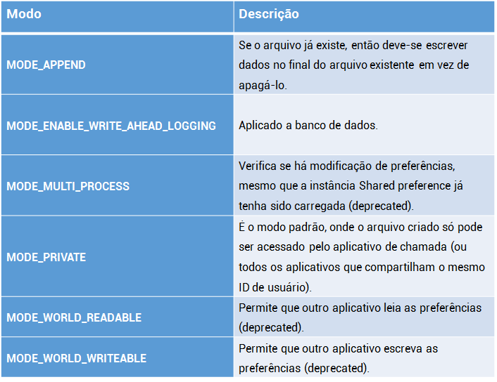
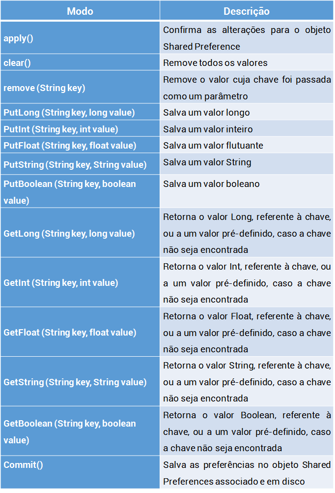
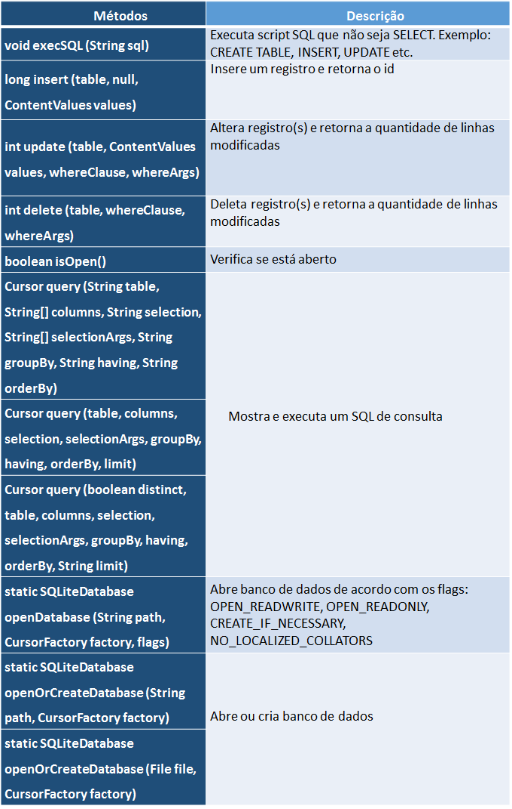

# Aula 8 - Persistência de Dados no Android

## Persistência de dados

A persistência de dados é uma necessidade na maiorias das aplicações.

O Android nos permite persistir dados de formas e em locais diferentes, como em arquivos usando o conceitos de Java.io ou em banco de dados, usando o SQLite.

A escolha da forma e do local dependerá de suas necessidades, como, por exemplo, se os dados serão privados ou não, o espaço necessário para armazenamento etc.

## Persistência de Dados em Android

Devemos escolher o tipo de persistência em função de algumas necessidades de armazenamento, como, por exemplo:

- Segurança de dados (Os dados serão privados?)

- Acesso aos dados (Os dados podem ser acessados por outras aplicações/usuários?)

- Espaço em disco (Qual a necessidade de espaço de armazenamento?)

Em Android, podemos persistir dados de nossa aplicação de várias formas diferentes.

Dentre as opções de armazenamento de dados, podemos escolher:

### Shared Preferences

É muito comum que nossas aplicações precisem armazenar pequenas quantidades de dados. A classe Shared Preferences se mostra como uma alternativa ao uso de banco de dados.

Ela permite salvar e recuperar pares de chave/valor de tipos primitivos de dados (booleans, floats, ints, longs, e strings) em um arquivo denominado Arquivo de Preferências, pois associa um “nome” a uma determinada informação para que depois se possa recuperá-la através desse nome.

Normalmente, usamos essa opção para poucas informações. Como exemplo desse tipo de armazenamento temos:

- Data do último acesso ao servidor;

- Pontuação de um jogo;

- Configurações, como o nível em que um jogo será iniciado (Easy/Hard) e senha default do jogo.

Para criarmos um arquivo de preferências, podemos escolher formas:

**getSharedPreferences()**

- Se precisar acessar múltiplos arquivos de preferências em sua Activity;
- Tem como parâmetros o nome da Shared Preference e o modo de abertura.

Exemplo:

```java


       SharedPreferences sharedpreferences =
              getSharedPreferences(MinhasPreferencias,
              Context.MODE_PRIVATE);

```

**getPreferences()**
• Se precisar de um único arquivo de preferências para a Activity;
• Tem como parâmetro o modo de abertura;
• Não é definido o nome da Shared Preference por se tratar de um único arquivo.

Exemplo:

```java


       SharedPreferences sharedpreferences =
            getPreferences(Context.MODE_PRIVATE);

```

Além de privado, a classe Context nos oferece outros modos que estão listados abaixo:



Para salvar, usamos a classe SharedPreferences.Editor, que nada mais é do que uma classe auxiliar que escreve no arquivo.

Veja o exemplo abaixo:

```java

Editor editor = sharedpreferences.edit();
editor.putString("chave", "valor");
editor.commit();

```

Não podemos nos esquecer do método commit que efetiva a escrita no arquivo.

Além do método putString(), a classe Editor possui vários outros métodos. Entre eles podemos destacar:



### Internal Storage

Nossa segunda opção de persistência de dados possibilita que sejam salvos arquivos na memória interna do aparelho.

É bastante oportuno ressaltar que essa memória interna é a mesma onde são armazenados os arquivos da Shared Preferences e que, quando o aplicativo é desinstalado, seus dados são apagados, pois são dados privados de seu aplicativo.

Esse tipo de persistência faz uso da API Java I/O e cria os arquivos no diretório /data/data/pacote.do.aplicativo/files.

Entre as várias classes que nos permitem efetuar esse tipo de persistência podemos destacar:

Gravação:

FileWriter:

Implementa a gravação de streams de caracteres.

Exemplo de gravação em arquivo texto:

```java

File arquivo = new File("meu_arquivo.txt")
FileWriter fileWriter = new FileWriter( arquivo);
BufferedWriter bufferedWriter = new BufferedWriter(fileWriter);
         bufferedWriter.write("Oswaldo Borges Peres");

```

Como você pode observar, estamos trabalhando com Java.io da mesma forma que fazemos com programas para Desktop em Java.

No exemplo acima, vamos efetuar a gravação em um arquivo texto através da classe FileWriter. Poderíamos, a partir daí, usar o método append() dessa classe para efetuar a gravação, mas optamos por efetuar uma gravação bufferizada.

Para isso, faremos uso da classe BufferdWriter que recebe como parâmetro um FileWriter. Agora, basta usar o método write dessa classe para efetuar a gravação.

FileOutputStream:

Implementa a gravação de fluxos de bytes.

Exemplo de gravação em arquivo binário:

```java

FileOutputStream fOut = openFileOutput("arquivoTeste", MODE_APPEND);
                           String str = "data";
                           fOut.write(str.getBytes());
                           fOut.close();

```

Esse exemplo faz uso do método openFileOutput(), que abre um arquivo de escrita, retornando um FileOutputStream.

Nele são passados dois parâmetros:

1. nome do arquivo
   - O modo de abertura (no exemplo MODE_APPEND, para apenas acrescentar novas informações ao arquivo)

- Leitura:

  - FileReader: Implementa a leitura de streams de caracteres.

Exemplo de leitura em arquivo texto:

```java

File arquivo = new File("meu_arquivo.txt")
FileReader fileReader = new FileReader( arquivo );
BufferedReader bufferedReader = new BufferedReader(fileReader);
String linha= null;
while(bufferedReader.ready() ){
       linha += bufferedReader.readLine();
}

```

Vamos efetuar a leitura do arquivo texto gravado em nosso primeiro exemplo de gravação de dados. Para isso, faremos o uso da classe FileReader.

Implementaremos também a classe BufferedReader, para efetuar a leitura bufferizada, isto é, uma leitura de linha por linha, através de seu método readLine(). Esta recebe por parâmetro um FileReader.

FileInputStream:
Implementa a leitura de fluxos de bytes.

Exemplo de leitura em arquivo binário:

```java

FileInputStream fileInputStream = openFileInput(“arquivoTeste);
int meucaracter;
String aux="";
while( (meucaracter = fileInputStream.read()) != -1){
   aux = aux + Character.toString((char) meucaracter);
}
fin.close();


```

Já nesse exemplo fizemos uso do método openFileInput(), que retorna um FileInputStream.

### External Storage

Muitas aplicações precisam efetuar sua persistência em algum tipo de memória externa, como um SD Card, que é removível, ou até mesmo em uma partição interna não removível do dispositivo.

Esses arquivos podem ser acessados por qualquer aplicação, inclusive pelo usuário. Felizmente, o Android oferece suporte nativo para esse tipo de persistência, porém precisamos verificar o estado em que se encontra a memória auxiliar.

Para tanto, podemos implementar o método Environment.getExternalStorageState(), que, em síntese, verifica se a mídia está disponível ou não.

Este pode retornar, entre outras constantes:


Para acessar os arquivos, devemos implementar:


Como exemplo de tipos temos as constantes:


Segue abaixo um exemplo:

Não podemos esquecer de habilitar, no arquivo AndroidManifest.xml, a permissão “WRITE_EXTERNAL_STORAGE”.

```java

< uses-permission android:name="android.permission.WRITE_EXTERNAL_STORAGE"/>
< uses-permission android:name="android.permission.READ_EXTERNAL_STORAGE"/>

```

O trecho de código abaixo verifica se a mídia está montada e disponível somente para leitura:

```java

private static boolean isExternalStorageReadOnly() {
        String extStorageState = Environment.getExternalStorageState();
        if (Environment.MEDIA_MOUNTED_READ_ONLY.equals(extStorageState)) {
            return true;
        }
        return false;
    }

```

O trecho de código abaixo verifica se a mídia está montada:

```java

private static boolean isExternalStorageAvailable() {
        String extStorageState = Environment.getExternalStorageState();
        if (Environment.MEDIA_MOUNTED.equals(extStorageState)) {
            return true;
        }
        return false;
    }

```

## SQLite Databases

O SQLite, ao contrário da maioria de gerenciadores de banco de dados, não está sob o controle de um programa servidor em separado do programa do cliente. O programa do usuário possui uma biblioteca SQLite compacta, que lida com todo o acesso ao banco de dados, eliminando a necessidade do usuário instalar, configurar e manter informações de bancos de dados complexos.

Outra característica do SQLite é que cada aplicação pode criar um ou mais bancos de dados que são visíveis somente para a aplicação que o criou.

Esse pequeno e notável banco de dados tem se tornado cada vez mais popular, principalmente por desenvolvedores Android e IOS, uma vez que essas plataformas oferecem suporte nativo.

Podemos criar o banco de dados em SQLite de três formas diferentes:


### SQLite Databases - Classe SQLiteOpenHelper

No Android, os bancos criados serão acessíveis, pelo nome, somente pelas classe da aplicação. Salvo se for utilizado um provedor de conteúdo (Content Provider).

Para criar um banco de dados SQLite, precisamos implementar uma subclasse de SQLiteOpenHelper, que tem por responsabilidade criar o banco de dados, assim como gerenciar a versão do mesmo.

Para tanto, precisamos implementar os métodos:


A tabela abaixo destaca alguns métodos da classe SQLiteOpenHelper:


### SQLite Databases - Classe SQLiteDatabase

Essa classe contém métodos a serem executados nas tabelas em SQLite, como criar, atualizar, excluir, selecionar etc.

Existem muitos métodos na classe SQLiteDatabase. Alguns deles são:



É importante lembrar que, para a manipulação de dados do banco, podemos efetuar através dos métodos execSQL() e rawQuery() usando SQL ou através dos métodos insert(), delete(), update() e query().

Exemplo de execSQL:

`sqliteDatabase.execSQL("INSERT INTO ALUNO (nome, idade) values ('Oswaldo', 50);",`

Exemplo de rawSQL:

`Cursor result = database.rawQuery("SELECT * FROM ALUNO", null);`

### SQLite Databases - Classe ContentValues

Se você já implementou alguma vez um HashMap, não vai sentir nenhuma dificuldade de entender a classe ContentValues.

Através dessa classe, podemos armazenar o conteúdo de um registro para uma operação de persistência. Ela permite definir pares de chave-valor, onde a chave representa o identificador da coluna e o valor representa o conteúdo de uma coluna da tabela, como é demonstrado no código abaixo:

```java

ContentValues contentValue = new ContentValues();
contentValue.put(DBHelper.NOME, name);
contentValue.put(DBHelper.EMAIL, desc);
database.insert(DBHelper.NOME_TABELA, null, contentValue);

```

### SQLite Databases - Cursor

Assim como o ContentValues se assemelha ao HasMap, a classe Cursor se assemelha ao ResultSet do JDBC.

Ela é capaz de referenciar as linhas resultantes de uma consulta e, além disso, possui funções de navegação, tais como:


Content Provider

O Android disponibiliza o componente Content Provider, que permite o compartilhamento de dados entre aplicações.

Podemos usá-lo para ler e gravar dados armazenados nas preferências, arquivos ou até mesmo banco de dados.

A figura abaixo ilustra bem o nosso componente:


Um exemplo clássico desse componente é a lista de contatos, que pode fornecer nomes, endereços e telefones a vários aplicativos.

Podemos destacar como principais características do Content Provider:


Para que possamos acessar um Content Provider, ele possui um CONTENT_URI único, que identifica o conteúdo que vai gerenciar. Sua sintaxe é bastante simples:

`< prefixo>://< Autoridade>/< tipo_dados>/`


Exemplo:

Acessando uma lista de produtos:
content://profoswaldo.com.produtos/produtos/

Acessando o produto com id 1:
content://profoswaldo.com.produtos/produtos/1

O Android possui uma série de Content Providers nativos.
