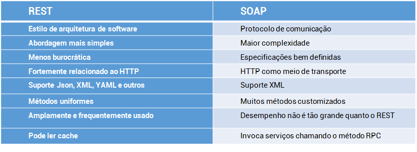
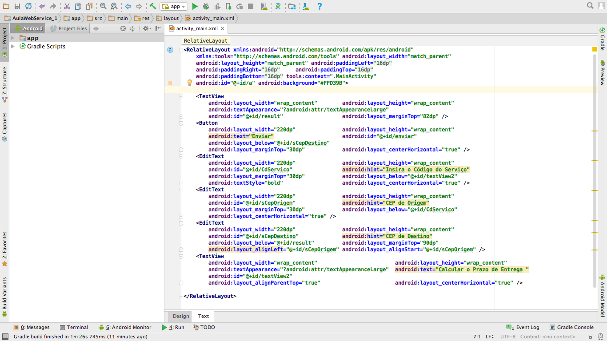
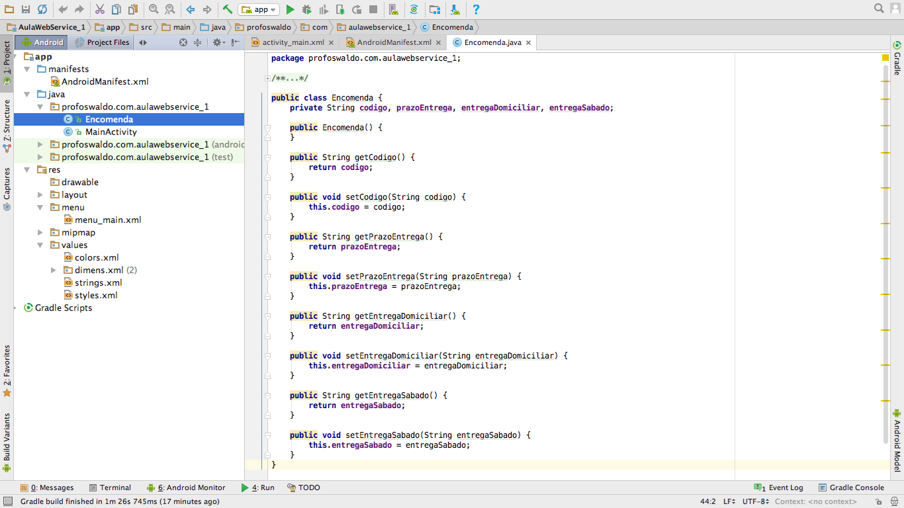
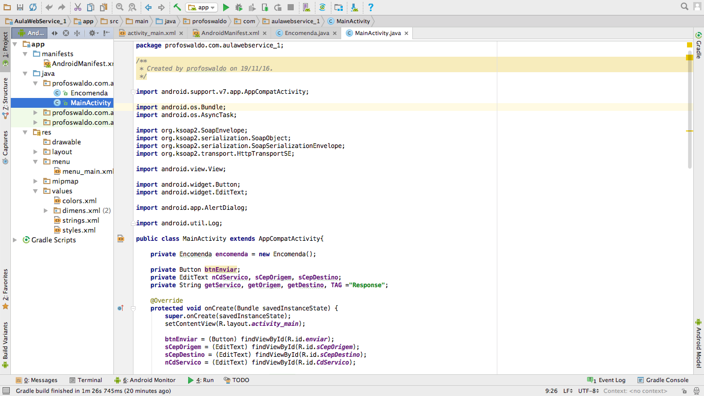
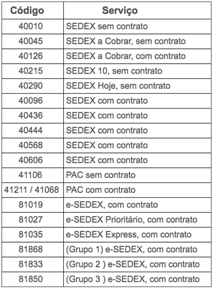
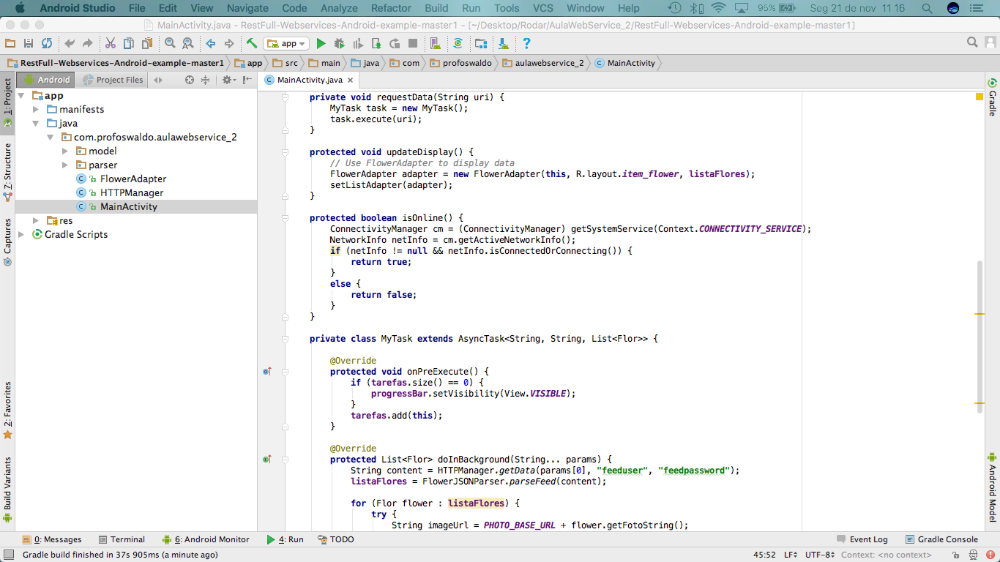

# Aula 9 - Web Service e o Android

## Fundamentos Web Service

Segundo a W3C (World Wide Web Consortium), Web Service é definido como um sistema de software projetado para suportar a interoperabilidade entre máquinas sobre a rede.

Essa tecnologia permite a comunicação entre aplicações, independente de sistema operacional e da linguagem de programação. Com isso, tem sido uma solução muito empregada para integração de sistemas.

## Principais vantagens do uso de Web Services

Entre as principais vantagens do uso de Web Services, podemos destacar:

- Reutilização de aplicações existentes

- Uso de padrões abertos como, por exemplo, XML e SOAP

- Interoperabilidade entre plataformas (Sistemas Operacionais) distintas

- Redução no tempo do processo de desenvolvimento

Como acessar o banco de dados de um servidor?

Como estudamos anteriormente, os dispositivos móveis possuem muitas limitações, como o baixo poder de processamento e armazenamento.

Mas se precisássemos de um banco de dados mais robusto que o SQLite, como poderíamos acessar um banco de dados de um servidor?

Um aplicativo Android, até por questões de segurança dos dados, não pode se conectar a um banco de dados do servidor.

Para tanto, a tecnologia Web Service se apresenta como uma solução, sendo de sua responsabilidade acessar o banco de dados, processar as informações e retornar os dados no formato XML ou JSON para o mobile/cliente ler os dados.

### Várias formas de criar Web Services

Não é nosso objetivo nesta aula discutir, na íntegra, a tecnologia Web Service, pois não faz parte da ementa de nosso curso.

Porém, precisamos saber que existem várias formas de criar Web Services. Dentre elas, destacamos:

### WSDL (Web Services Description Language):

- Descreve o formato das mensagens em XML;
- Tráfego de dados é feito via HTTP;
- Utiliza o protocolo SOAP (Simple Object Access Protocol);
- Maneira clássica de criar Web Services;
- Principais APIs: KSOAP2 e KXML, DOM e SAX;
- Normalmente empregado em serviços financeiros, portais de pagamento, serviços de telecomunicações.

### REST (Representational State Transfer):

- Criados geralmente sobre o protocolo HTTP, utilizando os métodos GET, DELETE, POST e PUT como padronização de seu acesso;
- Utiliza os próprios métodos do protocolo HTTP para criar a lógica necessária para o Web Service;
- O formato de retorno mais comum é o JSON (JavaScript Object Notation);
- Principais APIs: Restlet, Jersey, GSON e Jackson;
- Exemplos: serviços de mídias sociais, redes sociais, serviços Web Chat, serviços móveis.

#### Páginas simples com Get ou Post

- Corresponde a uma página web qualquer, que, ao receber uma requisição GET ou POST, vai retornar os dados no formato XML ou JSON, em vez de retornar a uma página HTML.

## Comparação entre Web Services REST e SOAP

A tabela abaixo demonstra algumas das principais diferenças entre Web Services REST e o SOAP:



## Análise de desempenho entre REST e SOAP

A imagem abaixo ilustra a diferença do tempo de resposta, em função do tamanho de bytes da mensagem, entre REST e SOAP.


Os dois tipos de Web Services possuem vantagens e desvantagens.

O gráfico acima demonstra que os Web Services do tipo REST possuem melhor tempo de resposta em aplicações que envolvam manipulações de dados onde resgatam as características da Web.

Por essa razão, é muito empregado no universo mobile, onde o custo na troca de mensagens é bastante elevado como, por exemplo, sites de relacionamento e blogs.

Isso não quer dizer que os Web Services SOAP estão ultrapassados. Eles são muito utilizados em empresas e organizações de grande porte.

## Aplicações Android e Web Services

Vamos desenvolver um pequeno projeto, passo a passo, para facilitar o entendimento.

Primeiramente, vamos criar um projeto Android. O nome do nosso projeto é AulaWeb Service_1.

Atenção! Não descreveremos os passos aqui, pois já fizemos isso na nossa aula 2.

### Editar arquivo AndroidManifest.xml

Altere o nosso arquivo AndroidManifest.xml, incluindo a linha

`< uses-permission android:name="android.permission.INTERNET"/ >`.

Embora também já tenhamos discutido isso, vale a pena lembrar que precisamos declarar esta permissão porque nosso aplicativo acessará a Internet.

Isto é ilustrado na tela abaixo:


### Implementar o layout

Implemente nosso arquivo de layout, conforme tela:



Não estamos discutindo a criação desse arquivo, pois esse assunto já foi exaustivamente discutido em nossas aulas 2, 3 e 4, bem como implementado em vários exemplos.

Implemente agora o arquivo Encomenda.java, conforme ilustrado na tela abaixo:



Esse arquivo representa a encomenda para qual desejamos verificar o prazo da entrega e se há entrega domiciliar aos sábados.

### Implementar a classe MainActivity.java

Agora vamos desenvolver a classe principal (MainActivity.java). Implemente, então, o código ilustrado nas telas abaixo.

Devido ao seu tamanho, precisamos capturar em três telas, conforme ilustrado a seguir:




A primeira parte de nosso programa já é bastante conhecida. A grande novidade de nosso código é a classe AsyncTask.

Seu objetivo é encapsular a implementação das classes Threads e Handler, tornando muito mais fácil a implementação desses conceitos em nosso aplicativo.

## Principais métodos da classe AsyncTask

### onPreExecute

- Executado antes da Thread iniciar;
- Muito comum para implementar configurações iniciais do processo, exibir uma janela de progresso ou até mesmo uma mensagem para usuário, como, por exemplo, “Aguarde.”.

### doInBackground

- Executado em background por uma Thread;
- Chamado após o método onPreExecute() ser finalizado;
- Nesse método deve ser implementado o processamento principal, como, por exemplo, uma busca em um Web Service ou qualquer outro processamento que demande tempo;
- Pode retornar um parâmetro para o método onPostExecute().

### onProgressUpdate

- Informa o andamento do processo;
- Podemos, por exemplo, usar para atualizar o status de uma barra de progresso.

### onPostExecute

- Chamado logo após o término do método onInBackground();
- Recebe o retorno do método onInBackground();
- Responsável por terminar a execução de nosso processo, como, por exemplo, fechar nossa janela de progresso.

## Principais linhas do código

Apresentada nossa classe AsyncTask, vamos analisar as principais linhas de nosso código.

Vamos começar pela linha `private class AsyncCallWS extends AsyncTask< Void,Void, Void >`.

Como você pode observar, a definição da `AsyncTask< Params,Progress, Result >` possui três tipos genéricos que correspondem respectivamente a:

### Params

- Tipo de parâmetro de entrada;
- Argumentos que podemos passar por parâmetro ao método execute (params...);
- Devemos usar “Void”, se não desejarmos passar algum parâmetro.

### Progress

- Tipo de parâmetro de incremento;
- Argumentos usados para informar o progresso do processo;
- Utilizados no método publishProgress() e onProgressUpdate().

### Result

- Tipo de parâmetro de retorno;
- Usado no método onInBackground() como sendo o seu retorno e o onPostExecute(Result).

Em nossa classe interna AsyncCallWS, implementamos somente os métodos doPostExecute() e o doInBackground().

O doPostExecute() possui o código necessário para exibir as informações referentes à Encomenda.

Todos os recursos empregados nesse método, como você pôde observar, já foram estudados em nossas aulas.

O método doInBackground() também é bastante simples, pois apenas chama o método CalcPrazo(), definido em nossa MainActivity.

A grande novidade, então, está no método CalPrazo(). Nele está definido todo o código necessário para o consumo das informações de nosso Web Service.

Para começar, observe as linhas de código abaixo:

```java
String SOAP_ACTION = "//tempuri.org/CalcPrazo";
String METHOD_NAME = "CalcPrazo";
String NAMESPACE = "//tempuri.org/";
String URL = "//ws.correios.com.br/calculador/CalcPrecoPrazo.asmx";

```

Nessas variáveis, foram definidas quadro importantes informações para acesso ao Web Service, que são:

- SOAP_ACTION: Possui o caminho completo do método do Web Service que será invocado

- METHOD_NAME: Possui o nome do método que será invocado pelo Web Service

- NAMESPACE: Possui o caminho onde o Web Service está hospedado

- URL: Possui o caminho do arquivo com o descritivo de todas as funções do Web Service.

Precisamos criar agora uma requisição SOAP, através de uma instância de um objeto do tipo SoapObject, para consumir os dados do Web Service.

O objeto SoapObject representará o caminho onde está hospedado nosso Web Service (namespace) e o nome do método a ser chamado (method_name).

Isso é feito através da linha:

```java
SoapObject ROequest = new
SoapObject(NAMESPACE, METHOD_NAME).

```

Esse objeto possui informações que serão passadas para o método do Web Service, como o código do serviço, CEP de origem e o CEP de destino.

Isso pode ser verificado nas linhas abaixo:

```java
Request.addProperty("nCdServico", getServico);
Request.addProperty("sCepOrigem", getOrigem);
Request.addProperty("sCepDestino", getDestino);

```

As próxima linhas relevantes de nosso programa são:

```java
SoapSerializationEnvelope soapEnvelope = new SoapSerializationEnvelope(SoapEnvelope.VER11);
soapEnvelope.dotNet = true;
soapEnvelope.setOutputSoapObject(Request);

```

Vamos entender com mais detalhes:

1. A classe SoapSerializationEnvelope é responsável por empacotar nossa requisição SOAP. Para tanto, precisamos criar um objeto desse tipo. Isso é feito através da linha SoapSerializationEnvelope soapEnvelope = new
   SoapSerializationEnvelope(SoapEnvelope.VER11), onde SoapEnvolope.VER11 corresponde à versão 1.1 do SOAP.

2. O método .dotNet = true define a compatibilidade com o padrão de codificação .net. Foi necessário definir esse padrão pois o Web Service foi desenvolvido na tecnologia .net.

3. Outro método importante é o .setOutputSoapObject(Request). Ele define o objeto de solicitação “SoapObject” para o envelope como a mensagem de saída referente à chamada de método de SOAP, ou seja, insere a requisição montada no envelope.

### Objeto responsável pela comunicação

Precisamos agora criar o objeto responsável pela comunicação. Isso é feito através da linha HttpTransportSE transport = new HttpTransportSE(URL).

A classe HttpTransportSE é responsável pela chamada ao servidor de aplicação, passando-se a URL como argumento.

Seu método .call(), quando executado, invocará o Web Service. Isso pode ser observado na linha transport.call(SOAP_ACTION, soapEnvelope), que recebe como parâmetro a localização de nosso Web Service (SOAP_ACTION) e nossa requisição SOAP “envelopada” pelo objeto do tipo SoapSerializarionEnvelope(soapEnvelope).

Para finalizar, obteremos a resposta através do método .getResponse() de nosso objeto envelope.

Isso pode ser observado nas linhas:

```java
SoapObject response = (SoapObject) soapEnvelope.getResponse();
response = (SoapObject) response.getProperty("Servicos");
response = (SoapObject) response.getProperty("cServico");

```

A partir daí nosso programa é bastante simples, pois apenas criamos um objeto do tipo Encomenda e populamos seus atributos.

Rodando nosso programa, você observará a tela:


Para teste, selecionamos o código do serviço 40010.

Existem vários outros, que podem ser verificados na tabela abaixo:



Além disso, selecionamos CEPs aleatórios, sendo o primeiro de origem do envio da encomenda e o segundo de destino.


### Classe FlowerJSONParser

Estamos chegando quase ao final de nosso código. Chegou a vez da classe FlowerJSONParser.

Seu código é ilustrado na imagem abaixo:


JSON nada mais é que um modelo para o armazenamento e troca de informações no formato texto.

Possui um conjunto classes e interfaces Java que podem ser estudadas, adaptadas e utilizadas livremente por qualquer desenvolvedor.

Sua principal característica é que ela trabalha lendo todo o documento JSON para a memória.

Em nosso exemplo, implementamos JSONArray e JSONObject.

Na linha JSONArray ar = new JSONArray(content), criamos um objeto do tipo JSONArray, passando a string recebida.

Podemos comparar esse objeto a um array comum, onde cada parte do JSON se transforma em uma posição.

Logo após, este array é percorrido e, para cada interação, é criado um objeto do tipo JSONObject, através do qual obteremos os dados de flor, conforme demonstrado no código abaixo:

```java
for(int i=0; i< ar.length(); i++) {
JSONObject obj = ar.getJSONObject(i);
Flor flower = new Flor();

flower.setFlorId(obj.getInt("productId"));
flower.setNome(obj.getString("name"));
flower.setCategoria(obj.getString("category"));
flower.setInstrucoes(obj.getString("instructions"));
flower.setFotoString(obj.getString("photo"));
flower.setPreco(obj.getDouble("price"));
flowerList.add(flower);}

```

## Classe principal (MainActivity)

Para finalizar, chegou a vez de nossa classe principal (MainActivity).

Para demonstrar o código completo dessa classe, foi necessário, devido ao seu tamanho, demonstrar o código em três tela:





Grande parte do código não apresenta nenhuma inovação.

Visto que já discutimos também a classe AsyncTask em nosso exemplo anterior, apenas é necessário destacar o trecho de código abaixo:

```java

protected boolean isOnline() {
ConnectivityManager cm = (ConnectivityManager) getSystemService(Context.CONNECTIVITY_SERVICE);
NetworkInfo netInfo = cm.getActiveNetworkInfo();
if (netInfo != null && netInfo.isConnectedOrConnecting()) {
      return true;
    }
                 else {
      return false;
   }
              }


```

Através da classe ConnectivityManager, podemos consultar o estado de conectividade da rede, notificando ao nosso aplicativo qualquer mudança ocorrida.

Para obter uma instância dessa classe, fazemos uso do método getSystemService(), que informa qual serviço do sistema será utilizado.

Em nosso exemplo, Context.CONNECTIVITY_SERVICE.

A partir daí, obtemos por retorno um objeto do tipo NetworkInfo, que possui detalhes sobre a rede de dados padrão ativa no momento.

Logo após, verificamos se está conectada ou conectando.

Execute nosso programa para verificar a tela abaixo:


Selecione a opção click, conforme apontado pela seta vermelha na imagem acima, para verificar a tela:


