# Introdução à computação móvel, a plataformas de desenvolvimento e à programação móvel Android

## Introdução ao Android

Computação móvel é a capacidade de ter acesso à informação, em qualquer lugar e a qualquer hora, onde existe total mobilidade do usuário.

## Dispositivo móvel

Um dispositivo móvel (handheld) é um computador de bolso, normalmente equipado com uma pequena tela (output) e um teclado em miniatura (input). Em alguns dispositivos móveis, o teclado está incorporado à tela, no que chamamos de dispositivo touchscreen, tal como nos tablets.

Existem diversas categorias de dispositivos de computação móvel. Entre os mais comuns estão:

- Smartphone;
- Tablet;
- PDA (Personal Digital Assistant);
- Celular;
- Console portátil;
- Coletor de dados;
- GPS (Global Positioning System).

## Conceito de mobilidade

O conceito base que impulsionou o desenvolvimento dos dispositivos móveis foi a mobilidade, que pode ser definida como: **A capacidade de poder ser movido fisicamente e/ou poder ser utilizado enquanto está em movimento.**

Para isso, os dispositivos móveis possuem determinadas características essenciais:

- Pequenos;
- Leves;
- Capacidade de memória e processamento limitados;
- Baixo consumo de energia;
- Conectividade ou não, ou, ainda, conectividade limitada;
- Inicialização mais rápida;
- Armazenamento de dados local e/ou remoto;
- Sincronização de dados com outros sistemas;

## Aplicativos

Os possíveis tipos de aplicativos são:

1. Nativo:
   - Desenvolvidas especificamente para uma determinada plataforma móvel;
   - Faz uso da linguagem de programação suportada pela plataforma e seu respectivo SDK (software development kit);
   - Normalmente, são instaladas através da loja de aplicativos, como, por exemplo, App Store e Google Play.
2. WebMobile:
   - Diferente das aplicações nativas, consiste em um site com layout otimizado para plataforma móvel;
   - Faz uso de linguagens web (HTML, CSS, Javascript);
   - Pode ser usado por qualquer plataforma móvel.
3. Híbrida:

   - Consiste na combinação dos tipos nativos e WebMobile;
   - Em geral, possui um navegador de internet customizado para o site do aplicativo;
   - É desenvolvido para uma plataforma móvel específica;
   - Tem se destacado nos últimos tempos.

4. Multiplataforma:
   - Faz uso de framework para geração de aplicações móveis.

</br>

## Principais sistemas operacionais de dispositivos móveis

Merecem destaque: IOS, Android, Windows Phone, BlackBerry, Symbian.

É público e notório que o Android tornou-se o sistema operacional mais usado em dispositivos móveis.

### Sistema Operacional Android

Android é um software open-source para dispositivos móveis, baseado no sistema operacional Linux.

Foi desenvolvido por uma empresa chamada Android Inc., situada na Califórnia-EHA, e fundada por Andy Rubin, Rick Miner, Nick Sears e Chris White, inicialmente para o desenvolvimento de aplicativos para celulares.

Em 2005, foi adquirida pela Google, que manteve Andy Rubin como colaborador no desenvolvimento da plataforma Android.

Em novembro de 2007, foi criada a Open Handset Alliance(OHA), formada por várias empresas do setor e capitaneada pela Google. A OHA fortaleceu o crescimento da plataforma Android.

Finalmente, em 2008, foi lançado o primeiro dispositivo móvel, usando o sistema operacional Android, batizado de HTC T-Mobile, cuja imagem é apresentada a seguir.

### Principais características do android


## Máquina virtual android

Assim como na linguagem Java, a plataforma android possui sua máquina virtual própria, denominada Dalvik Virtual Machine (DVM).

Otimizada para consumir menos memória, ela difere da Java Virtual Machine (JVM) porque os arquivos .class são convertidos para o formato .dex (Dalvik Executable), que corresponde à aplicação Android compilada, e compactados em um arquivo com extensão .apk (Android Package File) que representa a aplicação final.

A partir do Android 4.4, a DVM foi substituída pela Android Runtime (ART) que apresenta um desempenho muito superior em relação à DVM. Umas das principais diferenças entre a DVM e a ART é a forma de compilação.

Na DVM, o processo de compilação é baseado em JIT (Just in time). Como próprio nome diz, somente a parcela do código necessária para execução é compilada naquele momento. É importante lembrar que, devido somente uma parte do código ser compilada, esse processo consome menos memória e menos espaço físico no dispositivo.

Já na ART, ele é totalmente compilado na instalação do aplicativo e isso ocorre somente uma vez. Com isso, o código é muito mais rápido em sua execução porque não precisa ser compilado muitas vezes. Além disso, por demandar menor recursos de CPU, consome menos bateria.

## Plataforma Android

No Android, uma versão do sistema operacional é conhecida como plataforma. (LECHETA, 2015, p. 43)

Cada versão possui um código identificador (número inteiro) denominado API Level, que corresponde à versão da plataforma Android.

É importante ressaltar que o valor da API Level será usado quando forem definidos os dispositivos alvos para seu aplicativo.

## Arquitetura android

A arquitetura do android é agrupada em 3 níveis e é composta de 5 módulos:

1. Linux Kernel;
2. Libraries;
3. Android Runtime;
4. Application framework;
5. Applications.


### Applications

É nesse módulo que se encontram os aplicativos instalados, como, por exemplo:

- Cliente email;
- Navegador;
- Contatos;
- Mapas;
- Programas para SMS.

### Application framework

Fornece vários serviços para aplicações na forma de classes Java.

Os desenvolvedores de aplicativos têm permissão para fazer uso desses serviços em suas aplicações.

Os principais serviços são:

- Activity Manager - Controla todos os aspectos do ciclo de vida da aplicação e da pilha de atividade;
- Content Provider - Permite que os aplicativos publiquem e partilhem dados com outras aplicações;
- Resource Manager - Fornece acesso a recursos, como Strings, configurações de cores e layouts de interface do usuário;
- Notifications Manager - Permite que os aplicativos exibam alertas e notificações para o usuário;

- View System - Conjunto de views destinado a criar interfaces de usuário.

### Libraries

São as bibliotecas destinadas ao desenvolvimento Android.

Dentre elas, merecem destaque:

- Android.app - Fornece acesso à aplicação;
- Android.content - Facilita o acesso ao conteúdo, publicação e mensagens entre aplicativos e componentes dos aplicativos;
- Android.database - Usado para acessar os dados publicados por provedores de conteúdo e inclui classes de gerenciamento de banco de dados SQLite;
- Android.opengl - Uma interface Java para os gráficos OpenGL;
  Android.os - Fornece acesso aos serviços do sistema operacional padrão, incluindo mensagens, serviços do sistema e comunicação entre processos;

- Android.text - Usado para processar e manipular texto em uma tela do dispositivo;

- Android.view - Construção das interfaces com o usuário do aplicativo;

- Android.widget - Uma rica coleção de componentes de interface do usuário pré-construídos, tais como botões, etiquetas, exibições de lista, gerenciadores de layout, botões de rádio etc.

### Android runtime

Módulo que fornece a Dalvik Virtual Machine, que é uma espécie de Java Virtual Machine, especialmente projetado e otimizado para o Android.

### Linux kernel

É o nível de abstração do hardware do dispositivo que proporciona o gerenciamento de memória, de energia, de processos, de segurança, dentre outros;

Possui drivers essenciais do hardware.

## Componentes de um aplicativo android

Componentes são blocos de construção essenciais a um aplicativo Android.

O arquivo AndroidManifest.xml, que é único em cada aplicação, descreve cada componente da aplicação e como eles interagem.

Nele constam todas as configurações necessárias para executar a aplicação, como, por exemplo, o nome do pacote utilizado, o nome das classes de cada activity, as permissões que o aplicativo possui, qual a versão mínima da API Android, dentre outras configurações.

Os principais componentes que podem ser utilizadas dentro de uma aplicação Android são:

### Activity

É considerado o componente base de uma aplicação Android. Por isso, é o mais utilizado.

Consiste em uma classe gerenciadora de UI (Interface do usuário). Representa uma única tela do usuário.

Tanto o fluxo da aplicação como eventos de tela são de sua responsabilidade. Isso não significa que todo aplicativo precisa ter uma interface do usuário, mas, se tiver, precisará de, pelo menos, uma Activity.


### Intent

Uma Intent (intenção) é uma descrição abstrata de uma operação a ser executada. Ela pode ser utilizada para iniciar uma Activity, “ativar” um broadcast, enviar uma mensagem para uma aplicação que roda em outro processo etc. Uma Intent faz parte da arquitetura do Android e é um conceito básico que deve ser dominado por todos que desejam programar para Android.

Sendo assim, em linguagem mais humana, uma Intent representaria uma "Mensagem”, um pedido que é encaminhado ao sistema operacional. O sistema pegará a mensagem, verificará qual é a “Intenção da mensagem” e tomará uma decisão que pode ser desde abrir uma página na Web (um browser abrirá e a página será exibida), fazer uma chamada telefônica ou iniciar uma Actvity.

### Service

Quando o aplicativo possuir um ciclo de vida mais longo, normalmente colocamos em um Service.

Conhecido por ser um componente de background, responsável pelo processamento em segundo plano associado a uma aplicação.

Geralmente é utilizado para realizar tarefas de sincronização, como, por exemplo, sincronização de dados em segundo plano.


### Broadcast receiver

Lidam com a comunicação entre sistema operacional e aplicativos Android. São responsáveis por tratar eventos do sistema ou de outras aplicações.

Se um aplicativo precisar receber e responder a qualquer evento global, precisa registrar-se como um BroadCast Receiver.


### Content provider

Responsável pela gestão de dados e banco de dados.

Além de permitir o compartilhamento de dados entre aplicações, centraliza as rotinas de armazenamento e recuperação em um único local, provendo às aplicações dados.

Em outras palavras, podemos afirmar que corresponde a uma abstração de dados para seus clientes.

É importante lembrar que o Content Provider pode acessar qualquer forma de armazenamento de dados existente na plataforma Android, entre eles arquivos, banco de dados SQLite ou até mesmo mapas hash de memória, caso não precise persistir dados.


### Componentes adicionais

1. Fragments

   - Permitem a modularização da interface do usuário;

   - Representam uma parte da UI em uma atividade;

   - Assim como o activity, possuem seu próprio ciclo de vida e podem ser definidos como fragmento de um tela em um aplicativo android;

   - São uma espécie de "subatividade" que pode ser reutilizada em diferentes atividades.

2. Views
   - Elementos de interface do usuário que são desenhados na tela, como botões, quadros de texto e até mesmo gerenciadores de layouts;
   - São a classe-pai de todos os componentes visuais.
3. Layouts
   - Controlam o formato de tela e a aparência de interface do usuário, sendo possível serem criados com declaração de elementos XML ou através da programação Java.
4. Intents
   - Representam uma ação que a aplicação deseja executar. Isso se dá através de mensagem (Broadcast) enviada ao sistema operacional, que decidirá a realização ou não da ação, a partir do conteúdo dessa mensagem;
   - É importante lembrar que se constituem uma intenção, como próprio nome diz. Não há certeza de que a aplicação será executada.
5. Manifest
   - Arquivo que possui informações essenciais referentes à configuração para execução da aplicação, como, por exemplo, nome do pacote utilizado, nome das classes de cada activity e outros;
   - Deve estar na pasta raiz do projeto.

</br>

## Principais IDEs

A IDE é um ambiente integrado, que acelera o desenvolvimento de aplicativos durante a fase de programação.

1. Android Studio: https://developer.android.com/sdk/index.html

2. IntelliJ: https://www.jetbrains.com/idea/download/

3. Eclipse: https://eclipse.org/downloads/

## Revisão

Os principais componentes da plataforma de desenvolvimento android:

- Activity: é um componente de aplicativo que fornece uma tela com a qual os usuários podem interagir para fazer algo, como discar um número no telefone, tirar uma foto, enviar um e-mail ou ver um mapa. Cada atividade recebe uma janela que exibe a interface do usuário. Geralmente, a janela preenche a tela, mas pode ser menor do que a tela e flutuar sobre outras janelas.

- Intent: é um objeto de mensagem que pode ser usado para solicitar uma ação de outro componente de aplicativo.

- Service: é o componente responsável pelo processamento em segundo plano associado a uma aplicação.

- Broadcast Receiver: são componentes responsáveis por receber e tratar eventos (broadcasts) provenientes do sistema ou de outras aplicações. É sempre executada em segundo plano.

- Content Provider: são componentes responsáveis por prover às aplicações o conteúdo que elas precisam para funcionar, ou seja, os dados. Permitem o compartilhamento de dados entre aplicações, centralizam as rotinas de armazenamento e recuperam em um único local.

# Activity e Intent

## Estrutura de um projeto Android

O Android Studio pode abrir um projeto de cada vez. Cada projeto pode possuir um ou mais módulos.


Aqui temos os arquivos do diretório raiz do projeto:


Aqui temos os arquivos do módulo app:


Detalhes de alguns tipos de arquivos:

### Arquivo androidmanifest.xml

Considerado um dos principais arquivos de sua aplicação. É nele que são descritas informações essenciais à execução de seu projeto como, por exemplo:

- Nome do pacote utilizado;
- Nome das Activities;
- Permissões que o aplicativo possui;
- Versão mínima da API Android.


### Arquivo activity_main.xml

Esse arquivo, por default, possui este nome. Porém, podemos escolher um nome mais adequado.
Nesse arquivo são definidas as configurações para criação do layout da tela.


### Arquivo strings.xml

Esse arquivo centraliza as mensagens de seu aplicativo. Facilita muito, inclusive, a internacionalização do aplicativo.


### Classe R

Esse arquivo possui as referências para acessar os recursos de seu projeto.
É gerada automaticamente pelo compilador. É recomendável que essa classe não seja alterada manualmente.


## Activity

Muito similar ao JFrame do J2SE, a Activity é responsável por construir uma tela em Android, bem como tratar os eventos gerados por ela. Toda aplicação Android deve implementar ao menos um Activity, podendo chamar outras Activities.

O Android é responsável por gerenciar o ciclo de vida dos Activities. Para tanto, faz uso do conceito de pilha, chamada de “Activity Stacks” (pilha de atividades). Toda Activity ao ser executada é inserida no topo dessa pilha. A Activity anterior é parada e move-se para baixo da pilha.

O Android pode até mesmo encerrar Activities, se precisar de recursos. Neste caso, ele verifica a pilha de atividade para determinar a prioridade das atividades e quais podem ser fechadas.

Exemplo de uma pilha de atividades:


### Ciclo de vida activity


Os principais métodos do ciclo de vida Activity são:

- onCreate(): primeira função executada quando a Activity é criada. Tem por responsabilidade carregar os layouts XML, inicializar os objetos, variáveis e outras operações de inicialização. É importante lembrar que é executada somente uma vez.
- onStart(): é executado antes da Activity ficar visível na tela do dispositivo, podendo ser chamado após os métodos **onCreate()** ou **onRestart()**.
- onResume(): representa o estado que a Activity está executando. É chamada logo após o evento onStart.
- onRestart(): é chamado imediatamente após ao método onStart(), quando uma Activity que estava parada volta ao foco.
- onPause(): é chamado sempre que a tela da Activity fechar. Isto ocorre quando uma outra Activity (da sua aplicação ou não) ganhar o foco.
- onStop(): é chamado após o método **onPause()**, quando a Activity não está mais visível e está sendo encerrada.
- onDestroy(): é chamado antes da Activity ser destruída e logo após será liberada a memória.

No diagrama abaixo, referente ao ciclo de vida da Activity os 3 níveis:


1. **Entire lifetime**: tempo de vida completo. Ocorre desde a primeira chamada ao método onCreate() até a chamada do método onDestroy(), os quais são executados apenas uma vez durante o ciclo de vida da Activity.
2. **Visible lifetime**: tempo de vida visível. Ocorre entre uma chamada do método onStart() e a chamada correspondente do método onStop(). A activity pode estar no topo da pilha (visível para o usuário) ou em segundo plano.
3. **Foreground lifetime**: tempo de vida no topo da pilha. Ocorre entre uma chamada no método onResume() e a chamada correspondente do método onPause(). A Activity está no topo da pilha e interagindo com o usuário.

</br>

### Classe Intent

Cada Activity corresponde a uma tela de nossa aplicação no Android.

Devido à limitação de tamanho de nossos dispositivos, é muito comum distribuirmos componentes por várias telas visando facilitar o uso da aplicação.

Entre os vários componentes fundamentais, na programação de aplicativos Android (como Activities, Services e BroadCast Receivers), a Intent possibilita realizar a ligação, em tempo de execução, de componentes separados (por exemplo, chamar Activities diferentes).

Em outras palavras, podemos dizer que uma Intent nada mais é do que a intenção da aplicação em realizar uma determinada tarefa.

Trata-se de uma intenção, ou seja, não necessariamente será executada, pois depende da permissão do dispositivo.

A Intent envia ao sistema operacional o equivalente a uma mensagem (broadcast). Este receberá a chamada e, dependendo do conteúdo, tomará as providências necessárias. Como exemplo, podemos citar: Iniciar uma nova Activity; Iniciar Bluetooth do aparelho; Ligar o GPS (Global Positioning System); Efetuar uma ligação telefônica; Abrir o programa de envio de SMS (Short Message Service); Chamar o navegador Web; Enviar mensagens para o Sistema Operacional.

Uma Intent é basicamente um conjunto de dados que possui informações de interesse para os componentes que a recebem e também para o Android.

Deve conter:

- Componente
- Ação
- Dados
- Categorias
- Extras
- Flags

Podemos definir ações específicas de nossa aplicação, biblioteca ou ações pré-definidas conforme a tabela abaixo:

| Constante               | Component          | Ação                                                                                 |
| ----------------------- | ------------------ | ------------------------------------------------------------------------------------ |
| ACTION_CALL             | activity           | Inicia uma chamada de telefone.                                                      |
| ACTION_EDIT             | activity           | Mostra dados para o usuário editar.                                                  |
| ACTIVE_MAIN             | activity           | Inicia a atividade que está marcada como inicial em modo vazio e com nenhum retorno. |
| ACTIVE_SYNC             | activity           | Sincroniza dados no servidor a partir do dispositivo móvel.                          |
| ACTIVE_BATTERY_LOW      | broadcast receiver | Mostra um aviso que a bateria está baixa.                                            |
| ACTIVE_HEADSET_PLUG     | broadcast receiver | Mostra que um fone de ouvido foi plugado no dispositivo ou desplugado.               |
| ACTIVE_SCREEN_ON        | broadcast receiver | A tela foi ligada.                                                                   |
| ACTIVE_TIMEZONE_CHANGED | broadcast receiver | As configurações da zona de tempo foram mudadas.                                     |

Aqui temos as constantes pré-definidas:

| Constante           | Significado                                                                                                                            |
| ------------------- | -------------------------------------------------------------------------------------------------------------------------------------- |
| CATEGORY_BROWSABLE  | A atividade alvo pode ser chamada de maneira segura pelo navegador para mostrar dados referenciados por um link (imagem ou e-mail etc) |
| CATEGORY_GADGET     | A atividade pode ser embarcada dentro de outra atividade que hospeda gadgets.                                                          |
| CATEGORY_HOME       | A atividade mostra a tela home. A primeira tela que o usuário vê quando o dispositivo é ligado ou quando a tecla HOME é pressionada.   |
| CATEGORY_LAUNCHER   | A atividade pode ser a atividade inicial ou uma tarefa e é listada no tipo de aplicação launcher.                                      |
| CATEGORY_PREFERENCE | A atividade alvo é o painel de preferencias.                                                                                           |

### Tipos de Intents

**Explícitas**: como determina o componente pelo nome, é usada para passagem de mensagens no próprio app.

**Implícitas**: é enviada ao sistema operacional e pode ser tratada por componentes em outros apps. Nesse caso, a definição de quem tratará a intent é feita. O conteúdo do objeto intent é comparado com alguns filtros chamados "intent filters".

### Intent filter

Um Intent Filter informa ao sistema quais Intents um certo componente pode tratar. Um componente pode ter uma ou mais Intent Filters.


Com relação ao tipo implícito, as Intents serão entregues se um dos filtros atender aos critérios da Intent.

Já no caso da explícita, será entregue diretamente ao componente designado, não importando o filtro, pois nem chega a consultá-lo.

# Interface Gráfica do Usuário

## Componentes gráficos

A interface com o usuário é um ponto fundamental para o desenvolvimento de aplicativos Android, pois é através desta que o usuário interage.

A construção desse canal de comunicação demanda bastante tempo para desenvolvimento, principalmente no cenário mobile. Nele existe uma variedade muito grande de tipos dispositivos móveis, que, muitas vezes, possuem uma capacidade de tela superior até mesmo às televisões de última geração.

Para tanto, o Android oferece suporte nativo para o desenvolvimento de interfaces gráficas sofisticadas.

Podemos destacar a View, que é a classe base de todo e qualquer componente gráfico. Responsável por desenhar e controlar os eventos.

## Tipos de componentes

O Android fornece um conjunto muito grande de componentes, mas podemos agrupá-los em dois tipos:

Widgets: representa os componentes gráficos. É a base para a criação de componentes da interface, do usuário interativo, como, por exemplo, botões, caixas de texto entre outros.

View group: é a classe base para os gerenciadores de layout. Diferente do widgets, funciona como um container para outras views.

A imagem abaixo ilustra a hierarquia da classe View, demonstrando que o Android oferece um sofisticado e poderoso modelo baseado em Widgets e Layouts.


## Tipos de componentes gráficos

### TextView

Considerado um dos componentes mais usados em Android. Define um texto que será exibido na tela.

Por default, não pode ser editado, embora possamos alterar essa configuração.

```

< TextView
        android:id="@+id/resultado"
        android:layout_width="match_parent"
        android:layout_height="wrap_content"
        android:textAppearance="?android:attr/textAppearanceLarge"
        android:scrollHorizontally="true"
        android:textSize="40dp"/>

```

### Button

Nada mais é do que um simples botão.

Após clicarmos nele, podemos executar uma ação.

```

< Button
        android:id="@+id/button1"
        android:layout_width="80dp"
        android:layout_height="70dp"
        android:text="7"
        android:textSize="40dp" />

```

### ImageView

Responsável por inserir imagens.

```

< ImageView
        android:id="@+id/imageView1"
        android:layout_width="fill_parent"
        android:layout_height="fill_parent"
        android:src="@drawable/ic_launcher" />

```

### EditText

Uma caixa onde é digitada alguma informação, que poderá ser usada para interagir com a aplicação Android.

```

< EditText
        android:id="@+id/editText1"
        android:layout_width="fill_parent"
        android:layout_height="wrap_content"
        android:ems="10" >

```

### CheckBox

Um botão do tipo “caixa de seleção”, onde existe dois estados: verdadeiro ou falso.

```

< CheckBox
        android:id="@+id/cbbTeste"
        android:layout_width="wrap_content"
        android:layout_height="wrap_content"
        android:text="Exemplo />

```

### RadioButton

Similar ao CheckBox, porém não deve permitir a seleção de mais de uma opção.

### RadioGroup

Tem por objetivo agrupar estes radiobuttons, permitindo a seleção de apenas um RadioButton dentro deste Radiogroup.

```

< RadioGroup
        android:id="@+id/radioSex"
        android:layout_width="wrap_content"
        android:layout_height="wrap_content" >

< RadioButton
        android:id="@+id/radioMale"
        android:layout_width="wrap_content"
        android:layout_height="wrap_content"
        android:text="@string/radio_male"
        android:checked="true" />

< RadioButton
        android:id="@+id/radioFemale"
        android:layout_width="wrap_content"
        android:layout_height="wrap_content"
        android:text="@string/radio_female" />
```

## Implementação de Uis

Podemos implementar as Uis do usuário de forma declarativa e programática. Na declarativa, fazemos uso do XML para declarar a aparência da interface.

Já na programática, implementamos através da linguagem Java.
Podemos fazer uma analogia de declarativa com HTML e programática com a Swing e AWT do Java.

Devemos dar preferência sempre a forma declarativa, pois tende a ser mais fácil de entender, desenvolver e até mesmo manutenir.

## Gerenciadores de Layout

Aprendemos como desenvolver telas gráficas no Android, a partir de elementos visuais conhecidos por Widgets.

Porém, precisamos melhorar a qualidade de nossas telas, tarefa que nem sempre é tão fácil, no que tange à implementação.

Nossas aplicações precisam ser executadas em vários tipos de dispositivos diferentes, mas nem todos possuem as mesmas características, como, por exemplo, tamanho da tela.


Como apresentado anteriormente, a classe View é a base para todo e qualquer componente visual no Android. Já a classe ViewGroup tem como responsabilidade organizar os componentes de uma tela.

São conhecidos como Gerenciadores de Layouts. Funcionam como container para outros tipos de Views, podendo ser Widgets ou até mesmo outros ViewGroups.

## Principais layouts

**AbsoluteLayout (android.widget.AbsoluteLayout)**:

Os componentes são posicionados na tela em função das coordenadas X e Y fornecidas.

**FrameLayout (android.widget.FrameLayout)**:

O componente ocupa a tela inteira. Funciona como uma pilha sendo que uma view fica por cima da outra.

**LinearLayout (android.widget.LinearLayout)**:

Os componentes são organizados na vertical ou horizontal.

**TableLayout (android.widget.TableLayout)**:

Assim como em uma tabela, os componente são organizados em colunas e linhas.

**RelativeLayout (android.widget.RelativeLayout)**:

A organização do componente é implementada relativa a outro componente.

### AbsoluteLayout(deprecated)

Nesse tipo de gerenciador de layout, todos os componentes são posicionados em função de abcissa e ordenada, tendo como base o canto superior esquerdo.

É bastante oportuno lembrar que esse é menos flexível e mais difícil de manter que os demais gerenciadores. É importante também saber que esse gerenciador está obsoleto (Deprecated).

### FrameLayout

Serve para reservar um espaço na tela que será utilizado por um ou mais componentes.

Quando mais de um componente for inserido dentro de um único FrameLayout, haverá uma sobreposição dos mesmos. A menos, é claro, que você divida a tela e coloque cada um na sua posição.

### LinearLayout

Esse tipo de gerenciador de layout tem por característica a capacidade de alinhar verticalmente ou horizontalmente os componentes. Isso depende, obviamente, da orientação escolhida.

### RelativeLayout

O RelativeLayout organiza os componentes do layout de uma tela em relação uns aos outros.

Isso é uma grande vantagem deste gerenciador de layout, no que tange à flexibilidade de posicionamento dos componentes.

### TableLayout

Esse gerenciador de layout organiza seus componentes em colunas e linhas, ou seja, como uma tabela.

Cada < tableRow >< /tableRow > corresponde a uma linha de nossa tabela. As colunas são criadas à medida que incluímos os componentes em cada linha.

# Interface Gráfica Avançada

## ScrollView

É muito comum que telas de aplicativos tenham muitos componentes, dificultando a exibição de todos em uma única tela. Por isso, o componente ScrollView permite que barras de rolagens sejam apresentadas automaticamente, caso sejam necessárias para exibição de todos os componentes na mesma tela.

Embora o ScrollView possua vários métodos, implementá-los é bastante simples. Apenas precisamos nos lembrar que esta classe somente pode possuir um componente-filho e que as barras de rolagens serão inseridas automaticamente quando a View ultrapassar o tamanho da tela física.

Deve-se inserir dentro do ScrollView um ViewGroup que será responsável por conter todos os demais componentes.

O emprego do ScrollView é demonstrado abaixo:

```xml

<?xml version="1.0" encoding="utf-8"?>
            <ScrollView xmlns:android="//schemas.android.com/apk/res/android"
                 android:layout_width="fill_parent" android:layout_height="wrap_content" >
                 <LinearLayout
                 android:layout_width="fill_parent" android:layout_height="fill_parent"
                 android:orientation="vertical" >
                 <RadioButton
                     android:id="@+id/radioButton2" android:layout_width="wrap_content"
                     android:layout_height="wrap_content" android:text="RadioButton 1" />
                 <RadioButton
                     android:id="@+id/radioButton1" android:layout_width="wrap_content"
                     android:layout_height="wrap_content" android:text="RadioButton 2" />
                 <Button
                     android:id="@+id/button4" android:layout_width="match_parent"
                     android:layout_height="wrap_content" android:text="Botão 8" />
                 <CheckBox
                     android:id="@+id/checkBox1" android:layout_width="wrap_content"
                     android:layout_height="wrap_content" android:text="CheckBox" />
                 <!--Foram omitidos neste ponto vários outros componentes -->
            </LinearLayout>
            </ScrollView>

```

## Gerenciadores de Layouts aninhados

O Android permite a implementação de layouts aninhados, pois os Gerenciadores de Layouts são classes Views e, como estudado anteriormente, podem conter tanto Views simples (Widgets) como layouts (ViewGroups).

Assim, é possível implementar telas muito mais elaboradas apenas combinando as características de cada tipo de gerenciador de layouts.

## Listas

Sem sombra de dúvidas, um dos componentes mais implementados no Android é o ListView.

Normalmente, é utilizado quando precisamos exibir uma grande quantidade de dados na forma de lista, que pode possuir rolagem (scroll).

Podemos otimizá-lo com textos e imagens, tratar eventos de clique e de seleção.

# Menus e Fragmentos

## Menus

Em aplicativos Android, um recurso extremamente utilizado é o de menu. Basta você baixar alguns aplicativos na Google Play Store que os encontrará facilmente.

Embora sejam de fácil implementação, devemos reforçar os cuidados em relação à usabilidade e aparência dos mesmos. É muito comum encontrarmos aplicativos sem nenhum menu, menus sem ícones ou até mesmo com títulos inapropriados.

Por isso, é importante lembrarmos de que um bom apelo visual e/ou textual facilitará muito a interação do usuário com o aplicativo.

Podemos trabalhar com três tipos de menus em Android:

### Menu de opção e barra de opção

- É o menu default das aplicações Android;
- Normalmente encontramos nesse menu as principais opções.

Existem dois modelos:

1. Ícone (icon menu):

   - Disponível parte inferior da tela;
   - Suporta até seis itens de menu;
   - Suporta ícones;
   - Não suporta caixa de seleção;
   - Não suporta botões de rádio;
   - Android 2.3.x – API Level 10 ou Inferior.

2. Expandido (expanded menu):
   - Suporta mais de seis itens de menu;
   - Apresentado automaticamente na opção Mais (More) quando possuir mais de seis itens de menu;
   - Android 3.0 – API Level 11 ou superior.

### Menu de contexto

- É exibido quando o usuário clica e segura, por mais de 2 segundos, um componente visual;
- Não suporta atalhos, ícones ou até mesmo submenus;
- Pode ser compartilhado entre diferentes Views.

### Menu Pop-up

- Abre quando tocamos no item de menu Options (Opções) ou em menu contextual;
- Não suporta ícones;
- Não suporta submenus aninhados;

## Action Bar

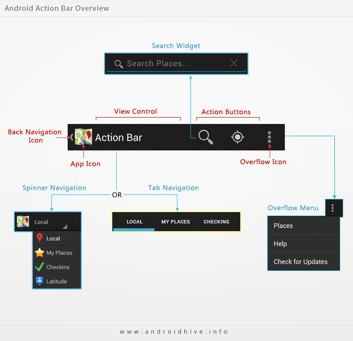

### App Icon

- Exibe o ícone do projeto ou logo customizado;
- Back Navigation Icon - permite a navegação para cima na hierarquia de telas.

### View control

- Exibe o título do aplicativo ou a tela em que o usuário se encontra;
- Exibe o controle de Navegação (Drop-down ou Tabs).

### Action buttons

- Exibem as ações mais comuns em seu aplicativo;
- Os ícones que não couberem nesse espaço serão inseridos automaticamente no Action OverFlow.

### Action Overflow

- Exibe as ações não utilizadas frequentemente de seu aplicativo.

Podemos desenvolver menus Android através de:

- Codificação (Java): desenvolvido no código de sua atividade;
- Arquivo XML: definido em um arquivo XML.

Exemplo:

Crie um novo projeto Android. Em nosso exemplo, o chamaremos de AulaMenu_1.

Provavelmente, não existe a pasta menu em sua árvore de recursos. Por isso, clique com o botão direito na pasta res e crie o diretório menu.

Agora crie o arquivo xml, chamado menu_main.

Nesse arquivo, serão definidos os itens que comporão nosso menu. Veja a tela:

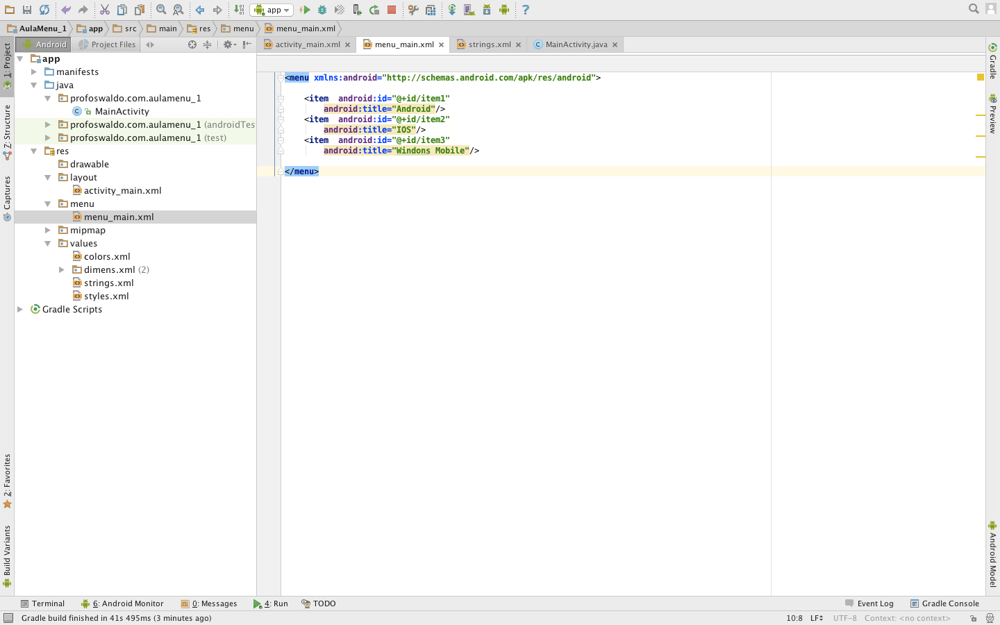

Se você olhar mais atentamente o código, perceberá que cada tag item é referente a uma opção do menu.

No nosso exemplo, os parâmetros são:

- android:id - Esse id é exclusivo para cada item. É através dele que podemos identificar o item de menu;
- android:title - É o texto título de nosso item de menu;
- aandroid:icon - Embora não tenha sido usado nesse exemplo, poderia definir um ícone para o nosso menu. O valor aqui é a referência a um drawable;
- android:showAsAction - Define a forma de exibição do componente.

As constantes que devemos empregar são:

- Always: o componente sempre fica visível. Recomendado para ações mais comuns do aplicativo.

- IfRoom: o componente é exibido na action bar, se existir espaço. Adequado para manter compatibilidade com diversos tipos de dispositivos e também com telas na vertical ou horizontal.

- WithText: o componente exibe o seu título ao lado do ícone, caso tenha espaço disponível.

- Nerver: não exibe o componente na action bar.

- CollapseActionView: quando a view é grande, deve ser contraída para exibidar apenas um botão.

É oportuno saber que também podemos combinar as constantes com separadores, como, por exemplo, ifRoom|withText.

Faça um teste em nossos exemplos. Você vai se surpreender com essas combinações.

Nesta próxima tela, temos algumas novidades.


Quando o botão físico do menu for acionado, o método `onCreateOptionsMenu (Menu menu)` de nossa atividade é invocado e, em nosso exemplo, faz uso do `MenuInflater` para criar o menu definido no arquivo menu_main.xml.

Isso pode ser verificado no método abaixo:

```java

@Override
  public boolean onCreateOptionsMenu(Menu menu) {
      getMenuInflater().inflate(R.menu.menu_main, menu);
      return true;
  }

```

Ao clicar em uma das opções do menu, o `onOptionsItemSelected(MenuItem item)` entra em ação.

Mas não para por aí, a classe `Toast(import android.widget.Toast)` é outra grande novidade. Ela é bastante similar ao nosso velho conhecido `JOptionPane`. Seu objetivo é exibir, por alguns segundos, uma pequena e breve mensagem de alerta para nosso usuário, sobre a tela vigente de nossa aplicação.

Podemos definir sua posição e até mesmo personalizar seu layout, mas esta nunca receberá o foco.

Sua sintaxe é bastante simples de entender. `Toast toast = Toast.makeText(contexto, texto, duracao); toast.show();`

Os parâmetros dessa classe correspondem:

- Ao contexto: este é o contexto de onde será exibida a mensagem.
- Ao texto: a mensagem que deverá exibida para o nosso usuário.
- À duração: é a definição do tempo que a nossa mensagem será exibida na tela.

Podemos configurar a partir das seguintes constantes:

- Toast.LENGTH_LONG - 4 segundos;
- Toast.LENGTH_SHORT - 2 segundos.

Após configurarmos nossa mensagem, é necessário executar o método .show() para que possa ser exibida.

Pronto. Excute sua aplicação para ver a tela abaixo.


Selecione uma das opções de nosso menu.

Observe que a mensagem foi exibida na parte inferior da tela.

Podemos alterar isso. Basta definirmos o método .setGravity().

Sua sintaxe é toast.setGravity(constante, valor_x, valor_y), onde:

- Constante: Constante Gravity. Existem várias constantes que você pode empregar e até mesmo combinar.

- Valor_x: Deslocamento x da posição;

- Valor_y: Deslocamento y da posição.

Exemplo 1: `toast.setGravity(Gravity.TOP|Gravity.LEFT, 0, 0);`

## Fragmento

Bastante similar a uma Activity, um fragmento (fragment) consiste em uma pequena porção de Activty, que permite um projeto mais modular.

Não seria errado afirmarmos, assim, que um fragment é uma espécie de subactivity.

Esse conceito surgiu com o Android 3.0 (Honeycomb) devido à necessidade de customizá-lo para as interfaces dos aplicativos, em função da pluralidade de tipos e tamanhos de dispositivos, em especial os tablets.

Veremos agora que um fragment é muito mais do que dividir a tela em duas ou mais. Vamos analisar o exemplo da tela abaixo para compreender o conceito:


Podemos perceber que na do SmartPhone, ao selecionarmos uma opção da lista, é necessário apresentar outra tela, devido ao tamanho do dispositivo.

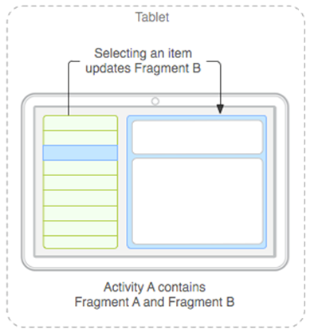

Já na figura do tablet a navegabilidade se dá na mesma tela.

É uma boa prática de desenvolvimento em Android sempre encapsular o código de uma activity em um fragment. Isso permite a reutilização deste código em outro contexto.

### Características

- Possui seu próprio layout e comportamento com os seus retornos de chamada do ciclo de vida;
- Pode ser utilizado em várias activities;
- Permite adicionar ou remover fragments de uma activity em execução;
- Ciclo de vida de um fragment está intimamente relacionado ao ciclo de vida de sua activity de acolhimento, o que significa que, quando a activity estiver em pausa, todos os fragments disponíveis na activity também serão interrompidos;
- Permite combinar vários fragments em uma única activity;
- Permite implementar um comportamento que não tem nenhum componente interface do usuário.

### Ciclo de vida de Fragment

Embora o Fragment possua seu próprio ciclo de vida, que é bastante similar ao de uma activity, este não é uma entidade independente.

Na verdade, é parte de uma activity hospedeira, que orienta o seu ciclo de vida.

Isso é demonstrado na figura abaixo:

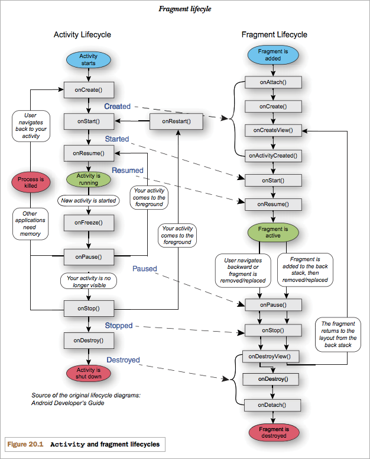

## Métodos do ciclo de vida


## Fragments e suas subclasses

Para implementar um fragment é preciso estender uma das classes abaixo:

Fragments - Comportamento específico dentro de uma Activity (Ex: parte de interface ou operação);
DialogFragment - Exibir uma janela por cima da janela de sua Activity;
ListFragment - Exibe uma lista de itens de uma fonte de dados;
PreferenceFragment - Armazena e acessa dados de configuração de uma aplicação;
WebViewFragment - Exibe WebView.

## API de Fragments

As principais classes da API Fragments são:

Fragment(android.app.Fragment)

- Classe que o fragment deve estender;
- É necessário sobrescrever o método onCreate (inflater, container, bundle) para criar a view.

Fragment(android.app.Fragment)
Classe que gerencia os fragments pela API;

Possui métodos findFragmentById(id) e findFragmentByTag(tag) utilizados para encontrar os fragments no layout, de forma similar ao método findViewById(id) que uma activity utiliza para buscar uma view.

Fragment(android.app.FragmentTransaction)

Classe utilizada para adicionar, remover ou substituir os fragments dinamicamente no layout.

## Criando Fragmentos

Para implementar um fragment, basta seguir os três passos básicos:

- Criar uma subclasse do fragment
- Definir o layout do fragment
- Incluir o fragment dentro da activity

# Mensagens e Notificações

## Toast

Como já discutido em aulas anteriores, a classe Toast(android.widget.Toast) é muito utilizada quando desejamos exibir mensagens de alertas para o usuário.

Esta exibe uma pequena tela, que pode ser personalizada, sem caráter permanente, ou seja, desaparecendo sem qualquer tipo de intervenção do usuário.

Para implementarmos este tipo de mensagem, é necessário obter uma instância de objeto Toast através do método estático, desta mesma classe, makeText(), que possui três parâmetros, conforme demonstrado abaixo:

`Toast.makeText (contexto, texto, duração)`

- No parâmetro contexto, definimos o contexto do aplicativo a ser exibido na mensagem;
- No parâmetro texto, definimos o texto a ser exibido na mensagem;
- No parâmetro duração, podemos definir o tempo de duração que a mensagem será exibida. A própria classe Toast nos oferece constantes para definirmos este tempo de duração, sendo elas Toast.LENGTH_SHORT e Toast.LENGTH_LONG.

Para exibir essa mensagem, precisamos apenas chamar o método show() do objeto.

## Notifications

Uma notificação Android nada mais é do que uma mensagem que aparece na barra de status Android. Seu objetivo é notificar ao usuário sobre algum evento, seja através de um ícone na barra de status, através de vibração, som ou acender de luzes do dispositivo.

É muito comum seu uso quando temos uma aplicação que roda em segundo plano, como, por exemplo, um aplicativo de mensagem instantânea, e não podemos ser interrompidos em uma aplicação que roda em primeiro plano, como, por exemplo, uma ligação telefônica.

### Opções de notificação

Além de exibir o ícone na barra de status, a classe Notification nos oferece mais três opções para configurar nossa notificação:

- Vibração: o dispositivo vibra rapidamente quando a notificação é recebida.

- Som: soa um alarme, seja um tom de chamada ou um tom gravado, quando a notificação é recebida.

- Luz: led pisca quando a notificação é recebida

A partir do Android 4.1 Jelly Bean, as notificações podem possuir os recursos:

- Visualização expansível: podemos expandir uma notificação usando o gesto "apertar e ampliar"

- Botões de ação: não estamos limitados a somente um botão de ação. Podemos adicionar até três botões.

- Estilos variados: BigTextStyle: Exibe um TextView com diversas linhas. BigInboxStyle: Exibe uma lista de informações.

- Tamanho maior: podem ser tão altas quanto 256 dp.

Para maiores informações você poderá acessar o link: https://developer.android.com/guide/topics/ui/notifiers/notifications.html

Para implementar uma notificação Android, precisamos obter a classe NotificationManager, visto que é um serviço do sistema não só executa, como gerencia as notificações.

As linhas abaixo demonstram os passos necessários para obter-se a NotificationManager:

`NotificationManager notificationManager =(NotificationManager) getSystemService(Context.NOTIFICATION_SERVICE);`

Após obtermos um NotificationManager, usamos a classe Notification.Builder para configurar nossa notificação.

Através dela, podemos configurar título, ícone e outros.

Isso é demonstrado no trecho de código abaixo:

```java

NotificationCompat.Builder builder = new NotificationCompat.Builder(this);
builder.setSmallIcon(R.drawable.ic_stat_notification);
builder.setContentIntent(pendingIntent);
builder.setAutoCancel(true);
builder.setLargeIcon(BitmapFactory.decodeResource(getResources(),R.drawable.ic_launcher));
builder.setContentTitle("BasicNotifications Sample");
builder.setContentText("Time to learn about notifications!");
builder.setSubText("Tap to view documentation about notifications.");


```

Devemos implementar, no mínimo, os métodos setSmallIcon(ícone pequeno), setContentTitle(título da notificação) e setContextText(Texto da Notificação).

Finalizando, implementamos um PendingIntent para o nosso builder.

Devemos criar somente um PendingIntent para todas nossas notificações.

## AlertDialog

Esta classe pode exibir uma caixa de diálogo com um título de até três botões.

Diferente da classe Toast, podemos interagir com o usuário pressionando botões.

Existem três regiões na AlertDialog que devemos configurar, conforme ilustrado na imagem abaixo:

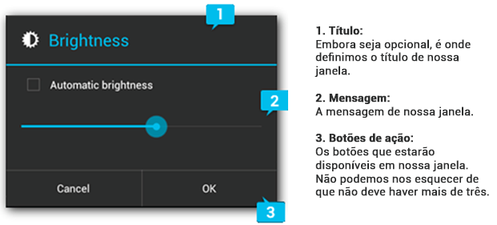

Finalizando, para criar nossa AlertDialog, fazemos uso da classe AlertDialog.Builder.

Métodos:

- setTitle: define o título de nossa
- setMessage: define a mensagem de nossa AlertDialog
- setPositiveButton: define um botão para aceitar e continuar uma ação - (Exemplo: OK)
- setNeutralButton: define um botão que não cancela e nem confirma uma ação - (Exemplo: Notifique-me mais tarde)
- setNegativeButton: define um botão para cancelar a ação (Exemplo: Cancel)
- show(): exibe a AlertDialog

## ProgressDialog

Este tipo de caixa de diálogo exibe um indicador de progresso e uma mensagem de texto opcional. Seu range de progresso é de 0 a 10000.

Quando o sistema for efetuar uma operação demorada, podemos implementar a ProgressDialog. Com isso, o usuário não pensará que o aplicativo travou.

Existem dois tipos de ProgressDialog que podemos implementar:


O método setProgressStyle define o estilo da ProgressDialog, podendo ser STYLE_HORIZONTAL(Loop Finito) ou STYLE_SPINNER(Loop Infinito).

## DatePickerDialog

É muito comum precisarmos configurar datas em nossos aplicativos. Para tanto, o Android nos disponibiliza a classe DatePicker, que nos permite selecionar uma data.

Embora a DatePicker possa ser usada como um widgets independente, ela ocupa muito espaço. É prudente, então, implementá-la dentro de uma caixa de diálogo.

Pensando nisso, o Android nos poupou trabalho fornecendo a classe DatePickerDialog, que é bastante simples de se implementar.

## TimePickerDialog

Bastante similar à DatePickerDialog, a classe TimerPickerDialog nos permite manipular o horário de nosso sistema.

# Estilos e Temas

## Recursos do Android

O desenvolvimento de interfaces para dispositivos móveis de qualidade é um fator determinante para o sucesso de qualquer aplicativo.

Conceitos como usabilidade, User Interface(UI) e User Experience(UX) nunca estiveram tão em pauta quanto nos dias de hoje. Porém, operacionalizar este desenvolvimento não é algo tão trivial assim.

Para tanto, o Android nos oferece uma série de recursos que facilitam não só o desenvolvimento, como a manutenção dessas interfaces.

Entre eles podemos destacar o tratamento, em arquivo XML, de:

- Dimensões;
- Cores;
- Strings;
- Valores;
- Estilos;
- Temas.

### Dimensões

Em grande parte de nossos exemplos, configuramos as dimensões de nossos componentes usando os parâmetros fill_parent, match_parent e wrap_content.

Também podemos configurar através de um número seguido de uma unidade de medida, como, por exemplo, 10sp.

Abaixo é demonstrada as unidades de medidas suportadas pelo Android:

- dp: É muito usada no desenvolvimento de layouts. Esta unidade abstrata baseia-se na densidade física da tela. A proporção de dp pode mudar com a densidade da tela, mas não a sua proporção. O conceito de dp é bastante complexo. Para maiores informações consulte o link: https://developer.android.com/guide/practices/screens_support.html

- sp: É muito usada para especificar tamanho da fonte em um aplicativo. Esta unidade é bastante similar à unidade de medida dp, mas é dimensionada de acordo com a preferência do tamanho de fonte do usuário.

- px: É uma unidade de medida não recomendada, salvo em casos bem específicos. Aqui um pixel corresponde a um pixel da tela. Ao desenvolvermos para um dispositivo específico, pode funcionar bem, mas em outros, devido à diferença de tamanho e densidade das telas, o resultado normalmente não é o esperado.

- pt: Pelo mesmo motivo da px, não é uma unidade de medida recomendada, pois tem como base o tamanho físico da tela. Um pt corresponde a 1/72 polegadas.

- mm: Assim como px e pt, também não é recomendada, pois trabalha com o tamanho físico da tela em milímetros.

- in: Assim como px, pt e mm, também não é recomendada, pois trabalha com o tamanho físico da tela em polegadas.

O Android permite que tratemos as medidas de qualquer componente via código Java, porém devemos defini-las em um arquivo chamado dimens.xml.

Você poderá encontrá-lo na pasta res/values de nosso projeto Android.

### Cores

Assim como as dimensões, também podemos definir a cor diretamente em nossas propriedades ou, como recomendado, em um arquivo chamado colors.xml. Este também se localiza na pasta res/values.

Em sua documentação oficial, a Google recomenda o uso da paleta de cores que pode ser encontrada no link: //www.google.com/design/spec/style/color.html

O padrão RGB (Red/Green/Blue) é usado para definir cores nas telas Android.

Para implementá-las, usamos a notação hexadecimal que é baseado no sistema de contagem com base 16.

Precisamos de seis caracteres precedidos pelo carater # para representar a cor, onde os dois primeiros são referentes à cor vermelha, os dois seguintes à cor verde e os dois últimos à cor azul.

Veja o exemplo abaixo:


Como já discutimos e exemplificamos em várias aulas anteriores o componente Button, abaixo apenas ilustramos um trecho de código que configura as cores de fundo e do texto de um Botão.

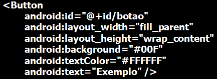

Podemos usar a representação reduzida da cor em hexadecimal.

Quando é representada por dois dígitos iguais para cada cor, podemos reduzir para três dígitos apenas.

Observe que definimos a android:background="#00F" com apenas três caracteres. Nesse caso, equivale ao android:background="#0000FF".

O exemplo abaixo demostra a configuração das cores azul e branco no arquivo colors.xml:


Nosso mesmo exemplo do botão agora ficaria assim:


### Strings

As Strings também devem ser definidas em um arquivo chamado string.xml, localizado na pasta res/values. Isso facilita, inclusive, a internacionalização de nosso aplicativo, pois podemos substituir o arquivo pelo que possui o idioma desejado.

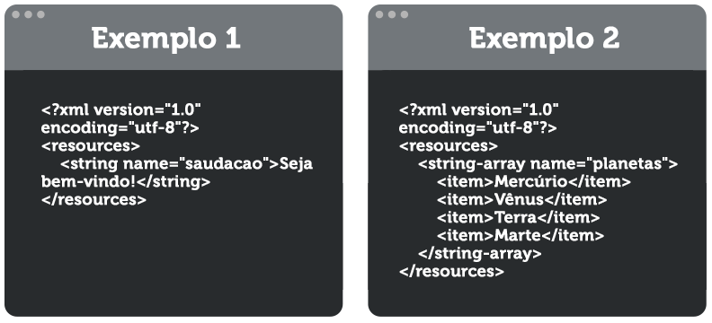

### Valores

Além de strings, podemos também definir valores constantes para vários tipos.

Para isso, precisamos criar o xml dentro da pasta res/values, atribuindo um nome para o arquivo.

Entre os mais comuns, podemos destacar:

Booleano: Valores booleanos:

Exemplo bools.xml:

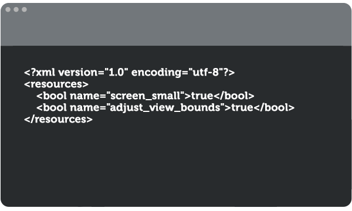

Inteiro: Valores Inteiros.

Exemplo integers.xml:


Array de inteiros: Vetor de inteiros.

Exemplo integers.xml:


Array tipado: Vetor com tipos misturados.

Exemplo:

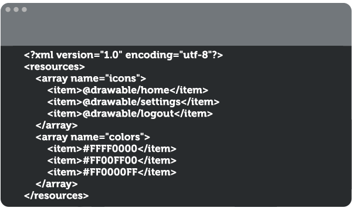

### Estilos – Conceito de estilo em android

Um estilo em Android corresponde a um conjunto de propriedades que especificam a aparência e o formato para uma View. Este pode especificar propriedades, tais como altura, preenchimento, cor de fonte, tamanho de fonte, cor de fundo e muito mais.

O estilo é definido em um arquivo XML que é separado do XML que especifica o layout.

O estilo Android permite que sejam separados de acordo com a concepção do conteúdo. Isso pode reduzir a duplicação da especificação de styles, pois podemos efetuar esta definição em um arquivo central, podendo ser aplicado em outras Views de nossa aplicação.

É bastante simples definir um conjunto de estilos. Basta criar um arquivo XML no diretório res/values/. Apenas não podemos esquecer que a tag deve ser a raiz.

O código abaixo define a especificação de um estilo chamado MeuEstilo no arquivo styles.xml:


Após definido um estilo, basta associar a um componente.

Veja o código abaixo:

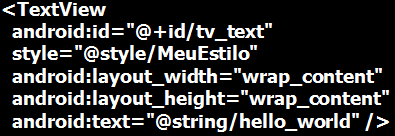

A partir de agora, o textView possui a cor de fonte vermelha e o tamanho de texto de 40sp, conforme foi definido no estilo chamado MeuEstilo.

#### Herança de estilo

O Android permite aplicar o conceito de herança da orientação a objetos para estilos.

Com isso, podemos:

- Fazer uso das propriedades definidas em um estilo pai;
- Modificar ou adicionar novas propriedades;
- Herdar estilos pré-definidos;
- Herdar estilos criados.

É bastante simples implementar a herança de estilo. Para herdar estilos pré-definidos do Android, devemos usar o atributo parent seguido de “@android:style/” + o estilo desejado.

No exemplo abaixo, destacamos em vermelho esse tipo de herança de estilo:


Já para herdar estilos definidos na própria aplicação, não usamos o atributo patent. Apenas usamos o nome do estilo herdado e acrescentamos o “.” + o novo nome.

O exemplo abaixo destaca em vermelho o emprego desse tipo de herança:


### Temas

Um tema é um estilo aplicado a uma Activity ou aplicação inteira, ao invés de uma View individual.

Quando um estilo é aplicado como um tema, todas as Views na Activity ou aplicação irão usar todas as propriedades de estilo por ele definidas.

Para definir um tema para aplicação ou uma atividade específica, precisamos editar o arquivo AndroidManisfest.xml, conforme exemplo abaixo:


# Persistência de Dados no Android

## Persistência de dados

A persistência de dados é uma necessidade na maiorias das aplicações.

O Android nos permite persistir dados de formas e em locais diferentes, como em arquivos usando o conceitos de Java.io ou em banco de dados, usando o SQLite.

A escolha da forma e do local dependerá de suas necessidades, como, por exemplo, se os dados serão privados ou não, o espaço necessário para armazenamento etc.

## Persistência de Dados em Android

Devemos escolher o tipo de persistência em função de algumas necessidades de armazenamento, como, por exemplo:

- Segurança de dados (Os dados serão privados?)

- Acesso aos dados (Os dados podem ser acessados por outras aplicações/usuários?)

- Espaço em disco (Qual a necessidade de espaço de armazenamento?)

Em Android, podemos persistir dados de nossa aplicação de várias formas diferentes.

Dentre as opções de armazenamento de dados, podemos escolher:

### Shared Preferences

É muito comum que nossas aplicações precisem armazenar pequenas quantidades de dados. A classe Shared Preferences se mostra como uma alternativa ao uso de banco de dados.

Ela permite salvar e recuperar pares de chave/valor de tipos primitivos de dados (booleans, floats, ints, longs, e strings) em um arquivo denominado Arquivo de Preferências, pois associa um “nome” a uma determinada informação para que depois se possa recuperá-la através desse nome.

Normalmente, usamos essa opção para poucas informações. Como exemplo desse tipo de armazenamento temos:

- Data do último acesso ao servidor;

- Pontuação de um jogo;

- Configurações, como o nível em que um jogo será iniciado (Easy/Hard) e senha default do jogo.

Para criarmos um arquivo de preferências, podemos escolher formas:

**getSharedPreferences()**

- Se precisar acessar múltiplos arquivos de preferências em sua Activity;
- Tem como parâmetros o nome da Shared Preference e o modo de abertura.

Exemplo:

```java


       SharedPreferences sharedpreferences =
              getSharedPreferences(MinhasPreferencias,
              Context.MODE_PRIVATE);

```

**getPreferences()**
• Se precisar de um único arquivo de preferências para a Activity;
• Tem como parâmetro o modo de abertura;
• Não é definido o nome da Shared Preference por se tratar de um único arquivo.

Exemplo:

```java


       SharedPreferences sharedpreferences =
            getPreferences(Context.MODE_PRIVATE);

```

Além de privado, a classe Context nos oferece outros modos que estão listados abaixo:


Para salvar, usamos a classe SharedPreferences.Editor, que nada mais é do que uma classe auxiliar que escreve no arquivo.

Veja o exemplo abaixo:

```java

Editor editor = sharedpreferences.edit();
editor.putString("chave", "valor");
editor.commit();

```

Não podemos nos esquecer do método commit que efetiva a escrita no arquivo.

Além do método putString(), a classe Editor possui vários outros métodos. Entre eles podemos destacar:


### Internal Storage

Nossa segunda opção de persistência de dados possibilita que sejam salvos arquivos na memória interna do aparelho.

É bastante oportuno ressaltar que essa memória interna é a mesma onde são armazenados os arquivos da Shared Preferences e que, quando o aplicativo é desinstalado, seus dados são apagados, pois são dados privados de seu aplicativo.

Esse tipo de persistência faz uso da API Java I/O e cria os arquivos no diretório /data/data/pacote.do.aplicativo/files.

Entre as várias classes que nos permitem efetuar esse tipo de persistência podemos destacar:

Gravação:

FileWriter:

Implementa a gravação de streams de caracteres.

Exemplo de gravação em arquivo texto:

```java

File arquivo = new File("meu_arquivo.txt")
FileWriter fileWriter = new FileWriter( arquivo);
BufferedWriter bufferedWriter = new BufferedWriter(fileWriter);
         bufferedWriter.write("Oswaldo Borges Peres");

```

Como você pode observar, estamos trabalhando com Java.io da mesma forma que fazemos com programas para Desktop em Java.

No exemplo acima, vamos efetuar a gravação em um arquivo texto através da classe FileWriter. Poderíamos, a partir daí, usar o método append() dessa classe para efetuar a gravação, mas optamos por efetuar uma gravação bufferizada.

Para isso, faremos uso da classe BufferdWriter que recebe como parâmetro um FileWriter. Agora, basta usar o método write dessa classe para efetuar a gravação.

FileOutputStream:

Implementa a gravação de fluxos de bytes.

Exemplo de gravação em arquivo binário:

```java

FileOutputStream fOut = openFileOutput("arquivoTeste", MODE_APPEND);
                           String str = "data";
                           fOut.write(str.getBytes());
                           fOut.close();

```

Esse exemplo faz uso do método openFileOutput(), que abre um arquivo de escrita, retornando um FileOutputStream.

Nele são passados dois parâmetros:

1. nome do arquivo
   - O modo de abertura (no exemplo MODE_APPEND, para apenas acrescentar novas informações ao arquivo)

- Leitura:

  - FileReader: Implementa a leitura de streams de caracteres.

Exemplo de leitura em arquivo texto:

```java

File arquivo = new File("meu_arquivo.txt")
FileReader fileReader = new FileReader( arquivo );
BufferedReader bufferedReader = new BufferedReader(fileReader);
String linha= null;
while(bufferedReader.ready() ){
       linha += bufferedReader.readLine();
}

```

Vamos efetuar a leitura do arquivo texto gravado em nosso primeiro exemplo de gravação de dados. Para isso, faremos o uso da classe FileReader.

Implementaremos também a classe BufferedReader, para efetuar a leitura bufferizada, isto é, uma leitura de linha por linha, através de seu método readLine(). Esta recebe por parâmetro um FileReader.

FileInputStream:
Implementa a leitura de fluxos de bytes.

Exemplo de leitura em arquivo binário:

```java

FileInputStream fileInputStream = openFileInput(“arquivoTeste);
int meucaracter;
String aux="";
while( (meucaracter = fileInputStream.read()) != -1){
   aux = aux + Character.toString((char) meucaracter);
}
fin.close();


```

Já nesse exemplo fizemos uso do método openFileInput(), que retorna um FileInputStream.

### External Storage

Muitas aplicações precisam efetuar sua persistência em algum tipo de memória externa, como um SD Card, que é removível, ou até mesmo em uma partição interna não removível do dispositivo.

Esses arquivos podem ser acessados por qualquer aplicação, inclusive pelo usuário. Felizmente, o Android oferece suporte nativo para esse tipo de persistência, porém precisamos verificar o estado em que se encontra a memória auxiliar.

Para tanto, podemos implementar o método Environment.getExternalStorageState(), que, em síntese, verifica se a mídia está disponível ou não.

Este pode retornar, entre outras constantes:

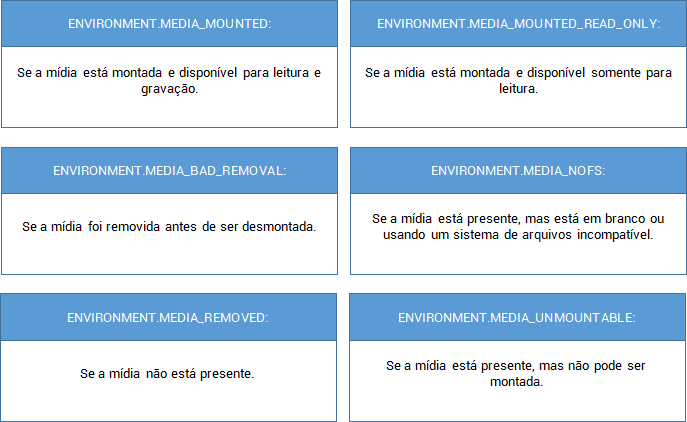

Para acessar os arquivos, devemos implementar:

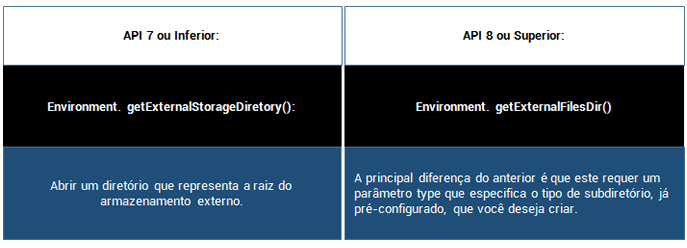

Como exemplo de tipos temos as constantes:

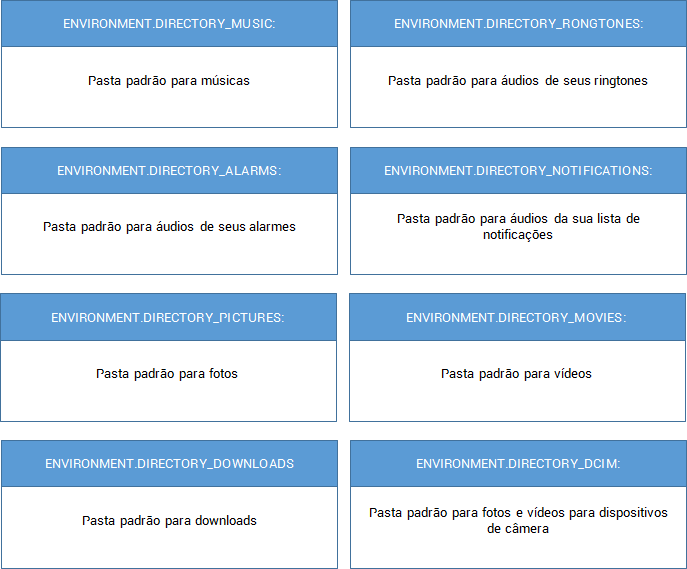

Segue abaixo um exemplo:

Não podemos esquecer de habilitar, no arquivo AndroidManifest.xml, a permissão “WRITE_EXTERNAL_STORAGE”.

```java

< uses-permission android:name="android.permission.WRITE_EXTERNAL_STORAGE"/>
< uses-permission android:name="android.permission.READ_EXTERNAL_STORAGE"/>

```

O trecho de código abaixo verifica se a mídia está montada e disponível somente para leitura:

```java

private static boolean isExternalStorageReadOnly() {
        String extStorageState = Environment.getExternalStorageState();
        if (Environment.MEDIA_MOUNTED_READ_ONLY.equals(extStorageState)) {
            return true;
        }
        return false;
    }

```

O trecho de código abaixo verifica se a mídia está montada:

```java

private static boolean isExternalStorageAvailable() {
        String extStorageState = Environment.getExternalStorageState();
        if (Environment.MEDIA_MOUNTED.equals(extStorageState)) {
            return true;
        }
        return false;
    }

```

## SQLite Databases

O SQLite, ao contrário da maioria de gerenciadores de banco de dados, não está sob o controle de um programa servidor em separado do programa do cliente. O programa do usuário possui uma biblioteca SQLite compacta, que lida com todo o acesso ao banco de dados, eliminando a necessidade do usuário instalar, configurar e manter informações de bancos de dados complexos.

Outra característica do SQLite é que cada aplicação pode criar um ou mais bancos de dados que são visíveis somente para a aplicação que o criou.

Esse pequeno e notável banco de dados tem se tornado cada vez mais popular, principalmente por desenvolvedores Android e IOS, uma vez que essas plataformas oferecem suporte nativo.

Podemos criar o banco de dados em SQLite de três formas diferentes:


### SQLite Databases - Classe SQLiteOpenHelper

No Android, os bancos criados serão acessíveis, pelo nome, somente pelas classe da aplicação. Salvo se for utilizado um provedor de conteúdo (Content Provider).

Para criar um banco de dados SQLite, precisamos implementar uma subclasse de SQLiteOpenHelper, que tem por responsabilidade criar o banco de dados, assim como gerenciar a versão do mesmo.

Para tanto, precisamos implementar os métodos:


A tabela abaixo destaca alguns métodos da classe SQLiteOpenHelper:

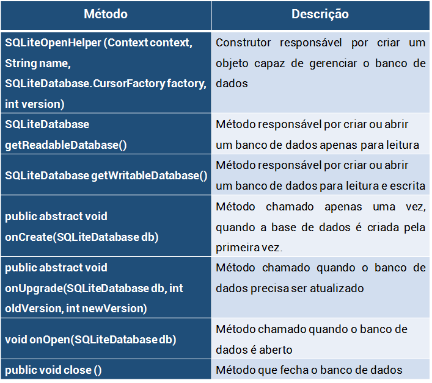

### SQLite Databases - Classe SQLiteDatabase

Essa classe contém métodos a serem executados nas tabelas em SQLite, como criar, atualizar, excluir, selecionar etc.

Existem muitos métodos na classe SQLiteDatabase. Alguns deles são:


É importante lembrar que, para a manipulação de dados do banco, podemos efetuar através dos métodos execSQL() e rawQuery() usando SQL ou através dos métodos insert(), delete(), update() e query().

Exemplo de execSQL:

`sqliteDatabase.execSQL("INSERT INTO ALUNO (nome, idade) values ('Oswaldo', 50);",`

Exemplo de rawSQL:

`Cursor result = database.rawQuery("SELECT * FROM ALUNO", null);`

### SQLite Databases - Classe ContentValues

Se você já implementou alguma vez um HashMap, não vai sentir nenhuma dificuldade de entender a classe ContentValues.

Através dessa classe, podemos armazenar o conteúdo de um registro para uma operação de persistência. Ela permite definir pares de chave-valor, onde a chave representa o identificador da coluna e o valor representa o conteúdo de uma coluna da tabela, como é demonstrado no código abaixo:

```java

ContentValues contentValue = new ContentValues();
contentValue.put(DBHelper.NOME, name);
contentValue.put(DBHelper.EMAIL, desc);
database.insert(DBHelper.NOME_TABELA, null, contentValue);

```

### SQLite Databases - Cursor

Assim como o ContentValues se assemelha ao HasMap, a classe Cursor se assemelha ao ResultSet do JDBC.

Ela é capaz de referenciar as linhas resultantes de uma consulta e, além disso, possui funções de navegação, tais como:


Content Provider

O Android disponibiliza o componente Content Provider, que permite o compartilhamento de dados entre aplicações.

Podemos usá-lo para ler e gravar dados armazenados nas preferências, arquivos ou até mesmo banco de dados.

A figura abaixo ilustra bem o nosso componente:


Um exemplo clássico desse componente é a lista de contatos, que pode fornecer nomes, endereços e telefones a vários aplicativos.

Podemos destacar como principais características do Content Provider:


Para que possamos acessar um Content Provider, ele possui um CONTENT_URI único, que identifica o conteúdo que vai gerenciar. Sua sintaxe é bastante simples:

`< prefixo>://< Autoridade>/< tipo_dados>/`

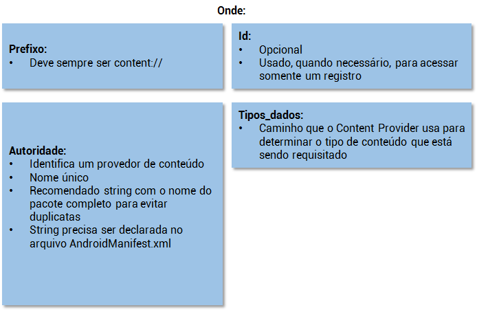

Exemplo:

Acessando uma lista de produtos:
content://profoswaldo.com.produtos/produtos/

Acessando o produto com id 1:
content://profoswaldo.com.produtos/produtos/1

O Android possui uma série de Content Providers nativos.

# Web Service e o Android

## Fundamentos Web Service

Segundo a W3C (World Wide Web Consortium), Web Service é definido como um sistema de software projetado para suportar a interoperabilidade entre máquinas sobre a rede.

Essa tecnologia permite a comunicação entre aplicações, independente de sistema operacional e da linguagem de programação. Com isso, tem sido uma solução muito empregada para integração de sistemas.

## Principais vantagens do uso de Web Services

Entre as principais vantagens do uso de Web Services, podemos destacar:

- Reutilização de aplicações existentes

- Uso de padrões abertos como, por exemplo, XML e SOAP

- Interoperabilidade entre plataformas (Sistemas Operacionais) distintas

- Redução no tempo do processo de desenvolvimento

Como acessar o banco de dados de um servidor?

Como estudamos anteriormente, os dispositivos móveis possuem muitas limitações, como o baixo poder de processamento e armazenamento.

Mas se precisássemos de um banco de dados mais robusto que o SQLite, como poderíamos acessar um banco de dados de um servidor?

Um aplicativo Android, até por questões de segurança dos dados, não pode se conectar a um banco de dados do servidor.

Para tanto, a tecnologia Web Service se apresenta como uma solução, sendo de sua responsabilidade acessar o banco de dados, processar as informações e retornar os dados no formato XML ou JSON para o mobile/cliente ler os dados.

### Várias formas de criar Web Services

Não é nosso objetivo nesta aula discutir, na íntegra, a tecnologia Web Service, pois não faz parte da ementa de nosso curso.

Porém, precisamos saber que existem várias formas de criar Web Services. Dentre elas, destacamos:

### WSDL (Web Services Description Language):

- Descreve o formato das mensagens em XML;
- Tráfego de dados é feito via HTTP;
- Utiliza o protocolo SOAP (Simple Object Access Protocol);
- Maneira clássica de criar Web Services;
- Principais APIs: KSOAP2 e KXML, DOM e SAX;
- Normalmente empregado em serviços financeiros, portais de pagamento, serviços de telecomunicações.

### REST (Representational State Transfer):

- Criados geralmente sobre o protocolo HTTP, utilizando os métodos GET, DELETE, POST e PUT como padronização de seu acesso;
- Utiliza os próprios métodos do protocolo HTTP para criar a lógica necessária para o Web Service;
- O formato de retorno mais comum é o JSON (JavaScript Object Notation);
- Principais APIs: Restlet, Jersey, GSON e Jackson;
- Exemplos: serviços de mídias sociais, redes sociais, serviços Web Chat, serviços móveis.

#### Páginas simples com Get ou Post

- Corresponde a uma página web qualquer, que, ao receber uma requisição GET ou POST, vai retornar os dados no formato XML ou JSON, em vez de retornar a uma página HTML.

## Comparação entre Web Services REST e SOAP

A tabela abaixo demonstra algumas das principais diferenças entre Web Services REST e o SOAP:


## Análise de desempenho entre REST e SOAP

A imagem abaixo ilustra a diferença do tempo de resposta, em função do tamanho de bytes da mensagem, entre REST e SOAP.


Os dois tipos de Web Services possuem vantagens e desvantagens.

O gráfico acima demonstra que os Web Services do tipo REST possuem melhor tempo de resposta em aplicações que envolvam manipulações de dados onde resgatam as características da Web.

Por essa razão, é muito empregado no universo mobile, onde o custo na troca de mensagens é bastante elevado como, por exemplo, sites de relacionamento e blogs.

Isso não quer dizer que os Web Services SOAP estão ultrapassados. Eles são muito utilizados em empresas e organizações de grande porte.

## Aplicações Android e Web Services

Vamos desenvolver um pequeno projeto, passo a passo, para facilitar o entendimento.

Primeiramente, vamos criar um projeto Android. O nome do nosso projeto é AulaWeb Service_1.

Atenção! Não descreveremos os passos aqui, pois já fizemos isso na nossa aula 2.

### Editar arquivo AndroidManifest.xml

Altere o nosso arquivo AndroidManifest.xml, incluindo a linha

`< uses-permission android:name="android.permission.INTERNET"/ >`.

Embora também já tenhamos discutido isso, vale a pena lembrar que precisamos declarar esta permissão porque nosso aplicativo acessará a Internet.

Isto é ilustrado na tela abaixo:

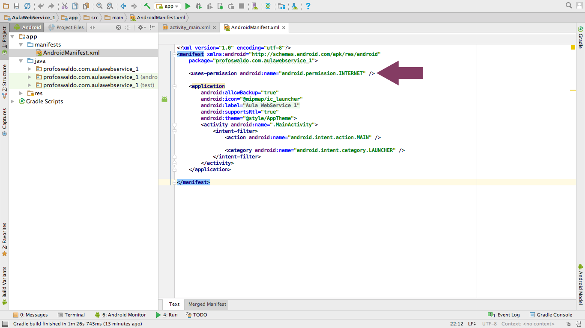

### Implementar o layout

Implemente nosso arquivo de layout, conforme tela:


Não estamos discutindo a criação desse arquivo, pois esse assunto já foi exaustivamente discutido em nossas aulas 2, 3 e 4, bem como implementado em vários exemplos.

Implemente agora o arquivo Encomenda.java, conforme ilustrado na tela abaixo:


Esse arquivo representa a encomenda para qual desejamos verificar o prazo da entrega e se há entrega domiciliar aos sábados.

### Implementar a classe MainActivity.java

Agora vamos desenvolver a classe principal (MainActivity.java). Implemente, então, o código ilustrado nas telas abaixo.

Devido ao seu tamanho, precisamos capturar em três telas, conforme ilustrado a seguir:


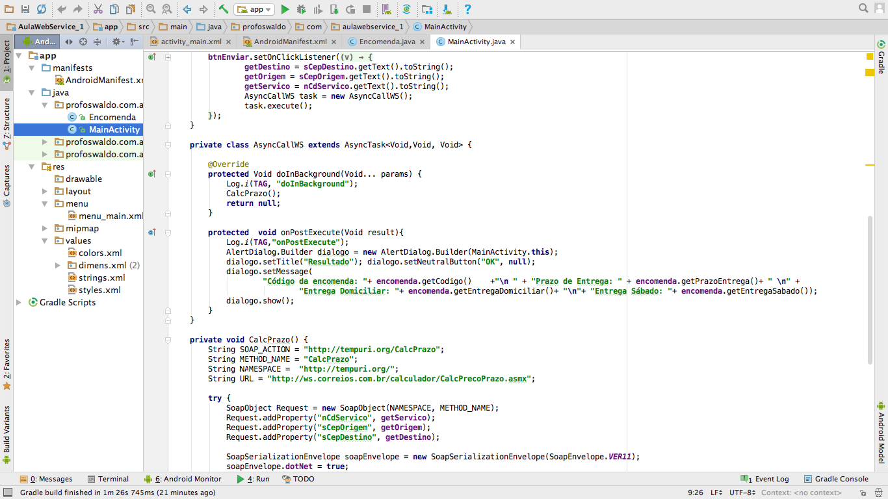
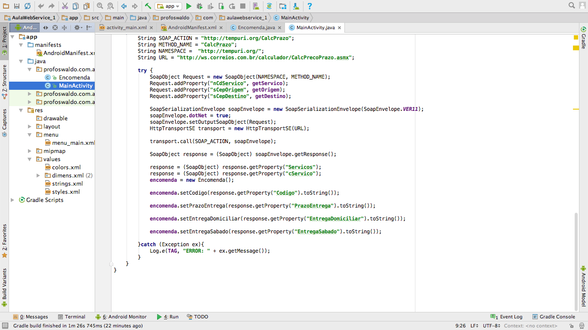

A primeira parte de nosso programa já é bastante conhecida. A grande novidade de nosso código é a classe AsyncTask.

Seu objetivo é encapsular a implementação das classes Threads e Handler, tornando muito mais fácil a implementação desses conceitos em nosso aplicativo.

## Principais métodos da classe AsyncTask

### onPreExecute

- Executado antes da Thread iniciar;
- Muito comum para implementar configurações iniciais do processo, exibir uma janela de progresso ou até mesmo uma mensagem para usuário, como, por exemplo, “Aguarde.”.

### doInBackground

- Executado em background por uma Thread;
- Chamado após o método onPreExecute() ser finalizado;
- Nesse método deve ser implementado o processamento principal, como, por exemplo, uma busca em um Web Service ou qualquer outro processamento que demande tempo;
- Pode retornar um parâmetro para o método onPostExecute().

### onProgressUpdate

- Informa o andamento do processo;
- Podemos, por exemplo, usar para atualizar o status de uma barra de progresso.

### onPostExecute

- Chamado logo após o término do método onInBackground();
- Recebe o retorno do método onInBackground();
- Responsável por terminar a execução de nosso processo, como, por exemplo, fechar nossa janela de progresso.

## Principais linhas do código

Apresentada nossa classe AsyncTask, vamos analisar as principais linhas de nosso código.

Vamos começar pela linha `private class AsyncCallWS extends AsyncTask< Void,Void, Void >`.

Como você pode observar, a definição da `AsyncTask< Params,Progress, Result >` possui três tipos genéricos que correspondem respectivamente a:

### Params

- Tipo de parâmetro de entrada;
- Argumentos que podemos passar por parâmetro ao método execute (params...);
- Devemos usar “Void”, se não desejarmos passar algum parâmetro.

### Progress

- Tipo de parâmetro de incremento;
- Argumentos usados para informar o progresso do processo;
- Utilizados no método publishProgress() e onProgressUpdate().

### Result

- Tipo de parâmetro de retorno;
- Usado no método onInBackground() como sendo o seu retorno e o onPostExecute(Result).

Em nossa classe interna AsyncCallWS, implementamos somente os métodos doPostExecute() e o doInBackground().

O doPostExecute() possui o código necessário para exibir as informações referentes à Encomenda.

Todos os recursos empregados nesse método, como você pôde observar, já foram estudados em nossas aulas.

O método doInBackground() também é bastante simples, pois apenas chama o método CalcPrazo(), definido em nossa MainActivity.

A grande novidade, então, está no método CalPrazo(). Nele está definido todo o código necessário para o consumo das informações de nosso Web Service.

Para começar, observe as linhas de código abaixo:

```java
String SOAP_ACTION = "//tempuri.org/CalcPrazo";
String METHOD_NAME = "CalcPrazo";
String NAMESPACE = "//tempuri.org/";
String URL = "//ws.correios.com.br/calculador/CalcPrecoPrazo.asmx";

```

Nessas variáveis, foram definidas quadro importantes informações para acesso ao Web Service, que são:

- SOAP_ACTION: Possui o caminho completo do método do Web Service que será invocado

- METHOD_NAME: Possui o nome do método que será invocado pelo Web Service

- NAMESPACE: Possui o caminho onde o Web Service está hospedado

- URL: Possui o caminho do arquivo com o descritivo de todas as funções do Web Service.

Precisamos criar agora uma requisição SOAP, através de uma instância de um objeto do tipo SoapObject, para consumir os dados do Web Service.

O objeto SoapObject representará o caminho onde está hospedado nosso Web Service (namespace) e o nome do método a ser chamado (method_name).

Isso é feito através da linha:

```java
SoapObject ROequest = new
SoapObject(NAMESPACE, METHOD_NAME).

```

Esse objeto possui informações que serão passadas para o método do Web Service, como o código do serviço, CEP de origem e o CEP de destino.

Isso pode ser verificado nas linhas abaixo:

```java
Request.addProperty("nCdServico", getServico);
Request.addProperty("sCepOrigem", getOrigem);
Request.addProperty("sCepDestino", getDestino);

```

As próxima linhas relevantes de nosso programa são:

```java
SoapSerializationEnvelope soapEnvelope = new SoapSerializationEnvelope(SoapEnvelope.VER11);
soapEnvelope.dotNet = true;
soapEnvelope.setOutputSoapObject(Request);

```

Vamos entender com mais detalhes:

1. A classe SoapSerializationEnvelope é responsável por empacotar nossa requisição SOAP. Para tanto, precisamos criar um objeto desse tipo. Isso é feito através da linha SoapSerializationEnvelope soapEnvelope = new
   SoapSerializationEnvelope(SoapEnvelope.VER11), onde SoapEnvolope.VER11 corresponde à versão 1.1 do SOAP.

2. O método .dotNet = true define a compatibilidade com o padrão de codificação .net. Foi necessário definir esse padrão pois o Web Service foi desenvolvido na tecnologia .net.

3. Outro método importante é o .setOutputSoapObject(Request). Ele define o objeto de solicitação “SoapObject” para o envelope como a mensagem de saída referente à chamada de método de SOAP, ou seja, insere a requisição montada no envelope.

### Objeto responsável pela comunicação

Precisamos agora criar o objeto responsável pela comunicação. Isso é feito através da linha HttpTransportSE transport = new HttpTransportSE(URL).

A classe HttpTransportSE é responsável pela chamada ao servidor de aplicação, passando-se a URL como argumento.

Seu método .call(), quando executado, invocará o Web Service. Isso pode ser observado na linha transport.call(SOAP_ACTION, soapEnvelope), que recebe como parâmetro a localização de nosso Web Service (SOAP_ACTION) e nossa requisição SOAP “envelopada” pelo objeto do tipo SoapSerializarionEnvelope(soapEnvelope).

Para finalizar, obteremos a resposta através do método .getResponse() de nosso objeto envelope.

Isso pode ser observado nas linhas:

```java
SoapObject response = (SoapObject) soapEnvelope.getResponse();
response = (SoapObject) response.getProperty("Servicos");
response = (SoapObject) response.getProperty("cServico");

```

A partir daí nosso programa é bastante simples, pois apenas criamos um objeto do tipo Encomenda e populamos seus atributos.

Rodando nosso programa, você observará a tela:


Para teste, selecionamos o código do serviço 40010.

Existem vários outros, que podem ser verificados na tabela abaixo:


Além disso, selecionamos CEPs aleatórios, sendo o primeiro de origem do envio da encomenda e o segundo de destino.

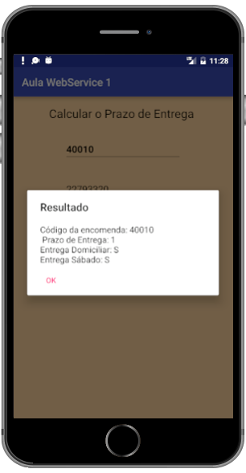

### Classe FlowerJSONParser

Estamos chegando quase ao final de nosso código. Chegou a vez da classe FlowerJSONParser.

Seu código é ilustrado na imagem abaixo:

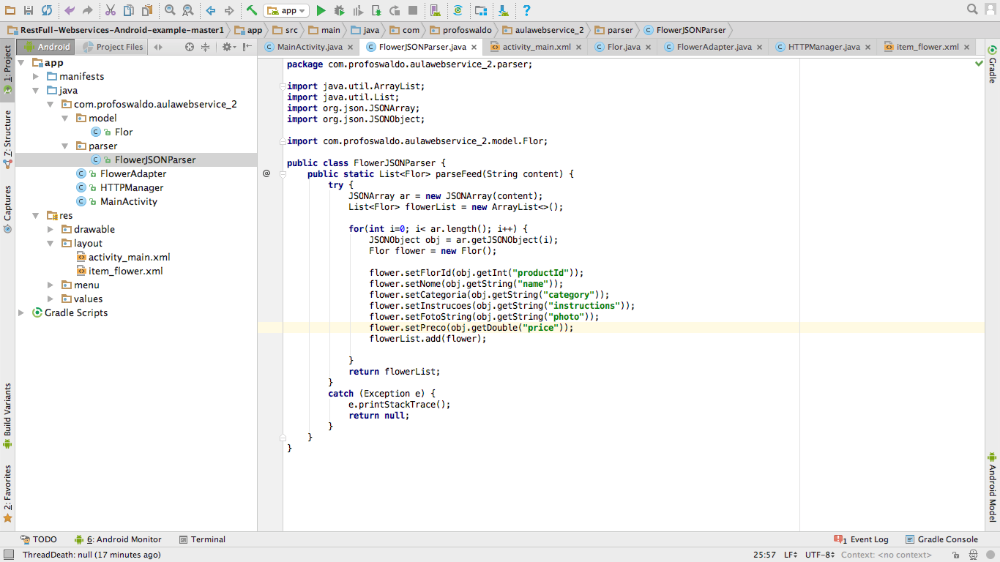

JSON nada mais é que um modelo para o armazenamento e troca de informações no formato texto.

Possui um conjunto classes e interfaces Java que podem ser estudadas, adaptadas e utilizadas livremente por qualquer desenvolvedor.

Sua principal característica é que ela trabalha lendo todo o documento JSON para a memória.

Em nosso exemplo, implementamos JSONArray e JSONObject.

Na linha JSONArray ar = new JSONArray(content), criamos um objeto do tipo JSONArray, passando a string recebida.

Podemos comparar esse objeto a um array comum, onde cada parte do JSON se transforma em uma posição.

Logo após, este array é percorrido e, para cada interação, é criado um objeto do tipo JSONObject, através do qual obteremos os dados de flor, conforme demonstrado no código abaixo:

```java
for(int i=0; i< ar.length(); i++) {
JSONObject obj = ar.getJSONObject(i);
Flor flower = new Flor();

flower.setFlorId(obj.getInt("productId"));
flower.setNome(obj.getString("name"));
flower.setCategoria(obj.getString("category"));
flower.setInstrucoes(obj.getString("instructions"));
flower.setFotoString(obj.getString("photo"));
flower.setPreco(obj.getDouble("price"));
flowerList.add(flower);}

```

## Classe principal (MainActivity)

Para finalizar, chegou a vez de nossa classe principal (MainActivity).

Para demonstrar o código completo dessa classe, foi necessário, devido ao seu tamanho, demonstrar o código em três tela:


Grande parte do código não apresenta nenhuma inovação.

Visto que já discutimos também a classe AsyncTask em nosso exemplo anterior, apenas é necessário destacar o trecho de código abaixo:

```java

protected boolean isOnline() {
ConnectivityManager cm = (ConnectivityManager) getSystemService(Context.CONNECTIVITY_SERVICE);
NetworkInfo netInfo = cm.getActiveNetworkInfo();
if (netInfo != null && netInfo.isConnectedOrConnecting()) {
      return true;
    }
                 else {
      return false;
   }
              }


```

Através da classe ConnectivityManager, podemos consultar o estado de conectividade da rede, notificando ao nosso aplicativo qualquer mudança ocorrida.

Para obter uma instância dessa classe, fazemos uso do método getSystemService(), que informa qual serviço do sistema será utilizado.

Em nosso exemplo, Context.CONNECTIVITY_SERVICE.

A partir daí, obtemos por retorno um objeto do tipo NetworkInfo, que possui detalhes sobre a rede de dados padrão ativa no momento.

Logo após, verificamos se está conectada ou conectando.

Execute nosso programa para verificar a tela abaixo:


Selecione a opção click, conforme apontado pela seta vermelha na imagem acima, para verificar a tela:


# Integrando Serviços Google a uma aplicação Android

## Mapas em Android

Entre os vários recursos oferecidos pelo Android, podemos destacar a integração ao Google Maps. A plataforma Android possui um conjunto robusto de classes e interfaces que facilitam o desenvolvimento de aplicativos que permitem a interação com mapas e geolocalização.

Basicamente, existem duas versões da API de mapas da Google.

Maps Android API V1

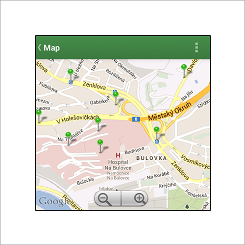

A versão 1, identificada como Google Maps Android API V1, foi descontinuada em dezembro de 2012. Ela era implementada pela classe MapView.

A principal limitação dessa versão consistia em que só era possível exibir um mapa de cada vez por tela, o que era uma grande desvantagem para o tablets.


Na mesma data, a Google lançou a Google Maps Android API V2. Além de um ganho significativo no desempenho, esta foi criada para suportar visualizações 2D e 3D. Inclusive, quando a visualização estiver bastante perto, poderá ocorrer automaticamente a comutação da visualização de 2D para 3D, caso a cidade possua visualização 3D.

A principal diferença para a API V1 é que passamos a utilizar fragments, conceito este que estudamos em nossa aula 5.

De uma forma resumida, podemos dizer que substituímos o uso de MapView por MapFragments.

### Gerando chave de acesso

Para que nossos mapas funcionem, precisamos criar uma chave de autenticação no serviço Google. Isso só é possível se possuirmos uma conta da Google.

Clique aqui para acessar a criação desta chave.

### Configurando permissões do sistema

Outro ponto necessário para que nossos aplicativos rodem com Google Maps é a configuração de algumas permissões no arquivo AndroidManifest.xml, visto que, por padrão, os aplicativos básicos não possuem permissões associadas.

A seguir, são apresentadas algumas das principais permissões usadas por aplicativos Android.

```java

<uses-permission android:name=“android.permission.INTERNET” />
• Permite o acesso à Internet.

<uses-permission android:name=“android.permission.ACESS_NETWORK_STATE” />
• Permite a leitura do estado da rede.

<uses-permission android:name=“android.permission.WRITE_EXTERNAL_STORAGE” />
• Permite gravar informações no SD card.

<uses-permission android:name=“android.permission.READ_EXTERNAL_STORAGE” />
• Permite ler informações no SD card.

<uses-permission android:name=“com.google.android.providers.gsf.permission.READ_GSERVICES” />
• Permite acessar os serviços da Google.

<uses-permission android:name=“android.permission.ACCESS_COARSE_LOCATION” />
• Permite acessar o GPS por triangulação de antenas.

<uses-permission android:name=“android.permission.ACCESS_FINE_LOCATION” />
• Permite acessar o GPS por hardware.

```

### Configurando chave de acesso

Além das permissões do sistema, precisamos configurar a chave de acesso em nosso arquivo AndroidManifest.xml.

O exemplo abaixo traz um pequeno trecho de código demonstrando essa configuração:


Atenção! Não se esqueça de que a chave acima, indicada pela seta vermelha, corresponde a que criamos. Substitua pela sua.

### Declarando dependência no arquivo app/buid.gradle

Para usar o Google Play Services, também precisamos declarar a dependência na build.gradle (Módulo: app) de arquivos e sincronizar os arquivos Gradle.

1. Primeiro, vamos incluir a linha Compile 'com.google.android.gms: play-services: 8.3.0' em dependências
   - Depois, vamos sincronizar o arquivo.

Para facilitar, veja na imagem abaixo a declaração dessa dependência:

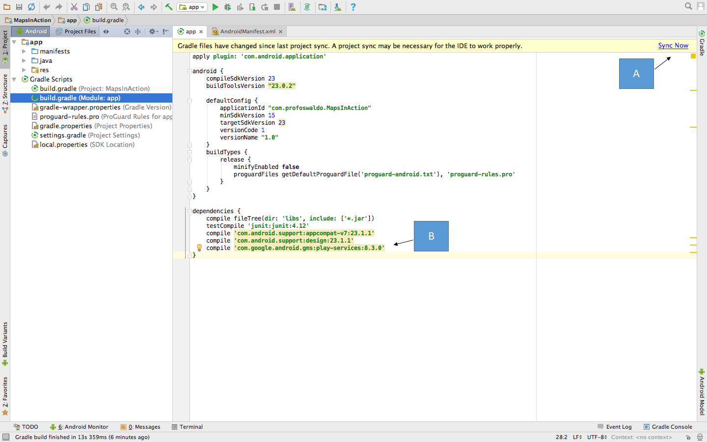

Atenção! Pode ser que haja novas versões da biblioteca quando estiver implementando seu exemplo. Fique à vontade para alterar.

Além disso, também precisamos configurar a versão do Google Play Service em nosso arquivo AndroidManifest.xml.

Isso é feito inserindo a tag abaixo dentro da application e não da activity:


### Exemplo com Mapas

Para usar o Google Play Services, também precisamos declarar a dependência na build.gradle (Módulo: app) de arquivos e sincronizar os arquivos Gradle.

Para facilitar o entendimento, vamos desenvolver um pequeno exemplo implementando Mapa em um aplicativo Android.

Criaremos um projeto Android novo.


#### Editar AndroidManifest.xml

Como nosso aplicativo precisará acessar a Internet, estamos configurando a permissão para tal.

Também estamos configurando a nossa chave de acesso aos serviços da Google.

Não se esqueça de, quando for implementar, substituir pela sua chave.

A tela abaixo ilustra essas configurações:


#### Implementar layouts

Chegou a vez do layout referente ao nosso mapa propriamente dito.

Precisamos adicionar um objeto Fragment à nossa Activity que processará o mapa.

Poderíamos adicionar o fragment via código Java, mas a forma mais fácil de fazer isso é adicionando um elemento <fragment> ao arquivo de layout.

No arquivo content_main.xml, definimos apenas o fragment referente ao nosso mapa.

Isso é demonstrado na imagem abaixo:

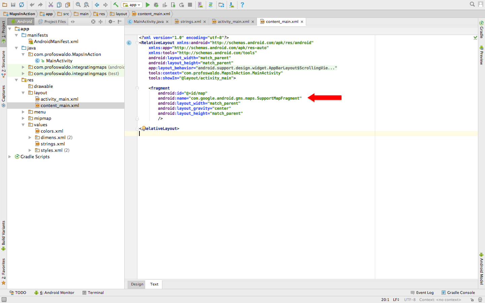

Como já discutimos anteriormente o aninhamento de layouts, optamos por desenvolver o layout de nossa tela no arquivo activity_main.xml, onde estamos efetuado o aninhamento do layout, referente ao mapa, na linha <include layout="@layout/content_main" />.

Isso é demonstrado na tela abaixo:


#### Implementar MainActivity.java

Chegou a vez de nossa atividade principal, codificada no arquivo MainActivity.java.

Devido ao tamanho de nosso código, ela foi ilustrada em duas telas:


Além dos vários códigos discutidos em exemplos de outras aulas, encontramos algumas novidades com relação a classes e interfaces sendo implementadas. Clique [aqui](http://estacio.webaula.com.br/cursos/gon283/galeria/aula10/docs/pdf_aula10_slide11.pdf) e conheça.

## Localização em Android

No desenvolvimento de aplicativos Android, o recurso de posicionamento geográfico é muito explorado.


Muitos aplicativos usam as coordenadas de latitude e longitude para informar ao usuário onde ele está localizado, como, por exemplo, os aplicativos de navegação GPS (Global Positioning System).

Antigamente, usávamos a classe LocationManager para obter a localização GPS.

Para acessar o provedor GPS, esta classe possuía várias constantes, das quais podemos destacar:

- LocationManager.GPS_PROVIDER: Usa os satélites GPS para determinar uma posição. É mais preciso, porém um pouco mais lento.
- LocationManager.NETWORK_PROVIDER: Usa a triangulação de antenas de operadora e sinal Wi-Fi para determinar uma posição. É muito mais rápido, porém muito mais preciso.

## Consumo de bateria

Um grande desafio que precisava ser vencido era o consumo de bateria. Isso ocorria pois a maioria dos aplicativos não fazia as otimizações necessárias, no que tange ao uso do GPS, utilizando, assim, recursos demais e implicando alto consumo de bateria.

Hoje a Google criou o Fused Location Provider. Este encapsula os provedores GPS_PROVIDER e NETWORK_PROVIDER de forma transparente, tornando muito mais simples o desenvolvimento. Sem falar no ganho expressivo que temos na otimização de recursos e, consequentemente, de bateria.

## Como fazer uso de uma API do Google Play Services?

Para que possamos fazer uso de qualquer API do Google Play Services, precisamos primeiramente nos conectar ao Google.


Também precisamos implementar um objeto do tipo LocationRequest. Através dele configuraremos não só a precisão mas o intervalo de tempo com o qual se deseja obter as coordenadas.

Vamos a um exemplo para que possamos entender na prática.

Observe que nossa activity implementa a interface com.google.android.gms.location.LocationListener. Com isso, somos obrigados a implementar o método void onLocationChanged(Location location), que recebe por parâmetro um objeto do tipo Location toda vez que o Android tiver uma nova localização.

Nesse mesmo método, estaremos exibindo em nossa tela as coordenadas de latitude e longitude através de dois TextViews.

Isso pode ser observado no trecho de nosso código abaixo:

```java

@Override
    public void onLocationChanged(Location location) {
        setLatitude(location.getLatitude());
        setLongitude(location.getLongitude());
        Toast.makeText(getApplicationContext(), "Nova localização recebida",
Toast.LENGTH_LONG).show();
        textViewLatitude.setText(getString(R.string.latitude_string) +" "+ getLatitude());
        textViewLongitude.setText(getString(R.string.longitude_string) +" "+ getLongitude());
    }


```

Antes de fazer a conexão, devemos verificar se o Google Play Services está instalado no dispositivo. Para esse propósito, foi criado o método checkPlayServices(), chamado em nosso exemplo de onCreate().

Observe que estamos fazendo uso do método isGooglePlayServicesAvailable() da classe GooglePlayServicesUtil, que verifica se o Google Play Services está instalado e ativo no dispositivo.

Seu retorno corresponde ao código de status, indicando se houve algum erro ou não.

Para não termos que decorar os valores dos erros, estamos lançando mão da classe ConnectionResult, que possui várias constantes referentes a esse status.

Entre estas, podemos destacar:

- SUCCESS: Conexão realizada com sucesso.

- SERVICE_MISSING: Google Play Services não disponível neste dispositivo.

- SERVICE_VERSION_UPDATE_REQUIRED: Versão do Google Play Services instalada está desatualizada.

- SERVICE_DISABLED: Versão do Google Play Services instalada está desativada.

- SERVICE_INVALID: Versão do Google Play Services instalada é inválida.

Caso não haja sucesso na conexão, podemos verificar se o erro pode ser resolvido por uma ação do usuário, através do método isUserRecoverableError() da classe GooglePlayServicesUtil.

Para facilitar a visualização, abaixo temos o trecho de código responsável por esta verificação:

```java

private boolean checkPlayServices() {
        int resultCode = GooglePlayServicesUtil.isGooglePlayServicesAvailable(this);
        if (resultCode != ConnectionResult.SUCCESS) {
            if (GooglePlayServicesUtil.isUserRecoverableError(resultCode)) {
                        Toast.makeText(getApplicationContext(),
                        "Erro. Efetue o download google play services", Toast.LENGTH_LONG)
                        .show();
            } else {
                Toast.makeText(getApplicationContext(),"Erro.", Toast.LENGTH_LONG).show();
                finish();
            }


```

Dando continuidade à análise do código, podemos observar, no método onCreate(), que, após verificar se o serviço está disponível, estamos executando o método startFusedLocation(), desenvolvido para efetuar a conexão ao Google Play Services.

Neste, criamos o objeto do tipo GoogleApiClient, caso não exista.

Para criarmos, precisamos instanciar esse objeto com a linha new GoogleApiClient(x), onde x corresponde ao contexto a ser usado pela conexão.

A partir daí, essa classe nos oferece uma série de métodos, dos quais, para estabelecer a conexão, destacam-se:

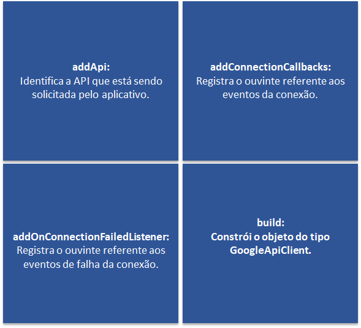

Para realizar a conexão, basta chamar o método connect().

Vejamos, então, nosso código do método startFusedLocation():

```java

public void startFusedLocation() {
        if (googleApiClient == null) {
            googleApiClient = new GoogleApiClient.Builder(this).addApi(LocationServices.API)
                  .addConnectionCallbacks(new GoogleApiClient.ConnectionCallbacks() {
                        @Override
                        public void onConnectionSuspended(int cause) {  }

                        @Override
                        public void onConnected(Bundle connectionHint) {   }
                    })
                  .addOnConnectionFailedListener(new GoogleApiClient.OnConnectionFailedListener(){
                        @Override
                        public void onConnectionFailed(ConnectionResult result) { }
                    })
                  .build();
            googleApiClient.connect();
        } else {
            googleApiClient.connect();
        }
    }


```

Configuramos a API de localização, no método addApi(), através da constante LocationServices.API.

É importante saber que existem muitas outras API que podem ser configuradas através desse método como, por exemplo, Drive.API, referente ao Google Drive.

Estamos registrando no método addConnectionCallbacks o ouvinte referente à nossa conexão.

A interface GoogleApiClient.ConnectionCallbacks exige que sejam implementados dois métodos:


Já no método addOnConnectionFailedListener(), estamos registrando o ouvinte referente à falha de conexão. A interface GoogleApiClient.OnConnectionFailedListener() nos obriga a implementar o método onConnectionFailed(), que é chamado quando ocorre um erro de conexão.

Para efetuar a conexão propriamente dita, usamos o método connect() do objeto GoogleApiClient. Já para desconectar, apenas precisamos chamar o método disconnect().

Para finalizar, foi desenvolvido o método registerRequestUpdate(), chamado no onCreate(), após o método startFusedLocation().

Veja o seu código abaixo:

```java

public void registerRequestUpdate(final LocationListener listener) {
        locationRequest = LocationRequest.create();
        locationRequest.setPriority(LocationRequest.PRIORITY_HIGH_ACCURACY);
        locationRequest.setInterval(1000);
        new Handler().postDelayed(new Runnable() {
            @Override
            public void run() {
try {
                    LocationServices.FusedLocationApi.requestLocationUpdates(googleApiClient,
                                locationRequest, listener);
                } catch (SecurityException e) {
                    e.printStackTrace();
                } catch (Exception e) {
                    e.printStackTrace();
                    if (!isGoogleApiClientConnected()) {
                        googleApiClient.connect();
                    }
                   registerRequestUpdate(listener);
                }
            }
        }, 1000);
    }


```

### Classe LocationRequest


Embora grande parte do código já seja de seu conhecimento, temos algumas novidades. Entre elas a classe LocationRequest.

Através dela, podemos efetuar configurações referentes à atualização da localização, como a precisão e o intervalo de tempo com as quais desejamos receber as coordenadas.

Para criar um objeto desse tipo, basta instanciar a classe.

Essa classe também possui vários métodos e constantes, dentre as quais destacam-se:

Métodos:

setPriority: Define a precisão do GPS. As constantes mais utilizadas são PRIORITY_HIGH_ACCURACY e PRIORITY_LOW_POWER.
setInterval: Intervalo de tempo, em milissegundos, das atualizações do GPS.
setFastestInterval: Intervalo mínimo de tempo, em milissegundos, das atualizações do GPS.

Constantes:

PRIORITY_HIGH_ACCURACY: Retorna a localização mais precisa possível.
PRIORITY_LOW_POWER: Retorna a localização aproximada visando economizar bateria.
PRIORITY_NO_POWER: Não inicia o monitoramento do GPS, mas garante que, se outra aplicação o fizer, receberemos essa localização. Com isso, não há um consumo adicional de energia.

### Método requestLocationUpdates()

Por último, temos o método requestLocationUpdates(), que efetivamente recupera a última localização conhecida pelo sistema.

Vamos executar nosso aplicativo e constatar uma tela similar à ilustrada abaixo:

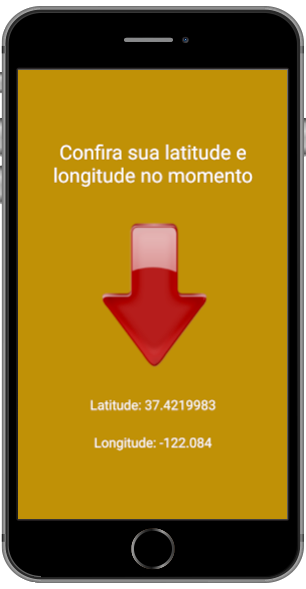
